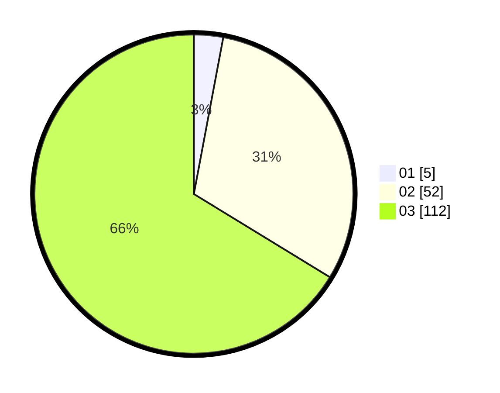

# Hasil

Hasil perolehan suara paslon dapat dilihat pada file paslon-01.txt, paslon-02.txt, dan paslon-03.txt.

Jika tidak ada, artinya data tersebut belum ada pada SIREKAP.

## Perolehan Suara

 * Paslon 01: **5**.
 * Paslon 02: **52**.
 * Paslon 03: **112**.

## Foto C Plano

https://sirekap-obj-formc.kpu.go.id/6001/pemilu/ppwp/31/73/04/10/01/3173041001004-20240215-023242--fb10a2ff-30d1-414b-a754-08a7c7f19bdb.jpg

https://sirekap-obj-formc.kpu.go.id/6001/pemilu/ppwp/31/73/04/10/01/3173041001004-20240215-003136--81c8b6d7-3b81-46dc-97e6-7db5a3793439.jpg

https://sirekap-obj-formc.kpu.go.id/6001/pemilu/ppwp/31/73/04/10/01/3173041001004-20240215-002735--7880fc80-c093-46a1-8af5-0913ca6a7d56.jpg

## DATA PEMILIH TETAP

Jumlah pemilih dalam DPT: **236**.
 * L: **104**.
 * P: **132**.

## DATA PENGGUNA HAK PILIH

Jumlah pengguna hak pilih dalam DPT: **169**.
 * L: **74**.
 * P: **95**.

Jumlah pengguna hak pilih dalam DPTb: **1**.
 * L: **0**.
 * P: **1**.

Jumlah pengguna hak pilih dalam DPK: **0**.
 * L: **0**.
 * P: **0**.

Jumlah pengguna hak pilih: **170**.
 * L: **74**.
 * P: **96**.

## JUMLAH SUARA SAH DAN TIDAK SAH

JUMLAH SELURUH SUARA SAH: **169**.

JUMLAH SUARA TIDAK SAH: **1**.

JUMLAH SELURUH SUARA SAH DAN SUARA TIDAK SAH: **170**.
