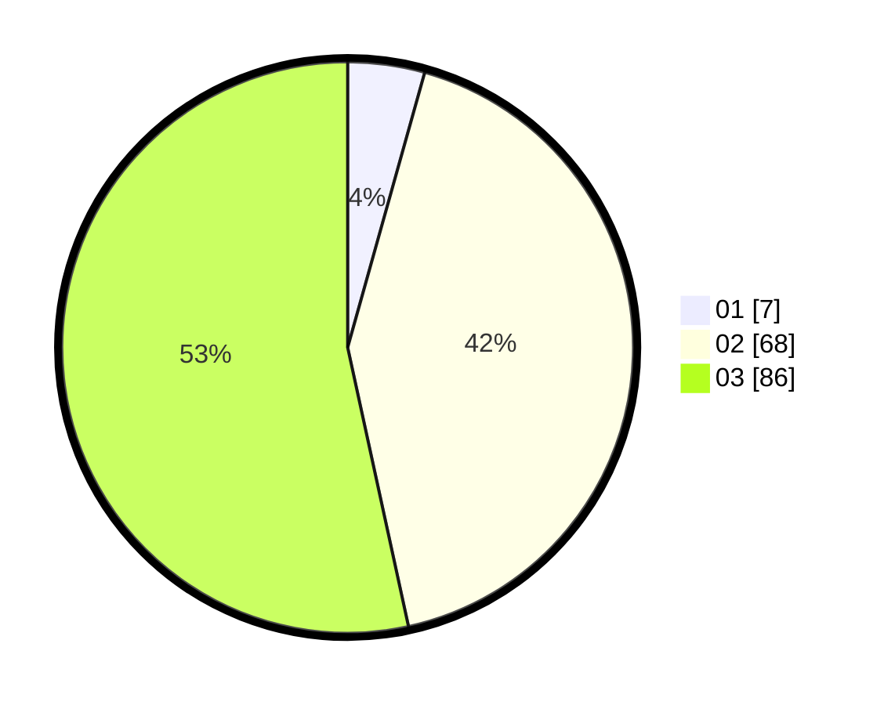

# Hasil

Hasil perolehan suara paslon dapat dilihat pada file paslon-01.txt, paslon-02.txt, dan paslon-03.txt.

Jika tidak ada, artinya data tersebut belum ada pada SIREKAP.

## Perolehan Suara

 * Paslon 01: **7**.
 * Paslon 02: **68**.
 * Paslon 03: **86**.

## Foto C Plano

https://sirekap-obj-formc.kpu.go.id/f425/pemilu/ppwp/31/73/04/10/01/3173041001008-20240214-202213--e2a60d3e-7cda-4e2c-933f-f65a2dfd663a.jpg

https://sirekap-obj-formc.kpu.go.id/f425/pemilu/ppwp/31/73/04/10/01/3173041001008-20240214-202312--44751cd5-00a4-40ba-a47c-20073853bc35.jpg

https://sirekap-obj-formc.kpu.go.id/f425/pemilu/ppwp/31/73/04/10/01/3173041001008-20240214-202357--79bc42d9-5ad7-4a2b-9415-24f32c22e9b8.jpg

## DATA PEMILIH TETAP

Jumlah pemilih dalam DPT: **237**.
 * L: **104**.
 * P: **133**.

## DATA PENGGUNA HAK PILIH

Jumlah pengguna hak pilih dalam DPT: **163**.
 * L: **76**.
 * P: **87**.

Jumlah pengguna hak pilih dalam DPTb: **0**.
 * L: **0**.
 * P: **0**.

Jumlah pengguna hak pilih dalam DPK: **0**.
 * L: **0**.
 * P: **0**.

Jumlah pengguna hak pilih: **163**.
 * L: **76**.
 * P: **87**.

## JUMLAH SUARA SAH DAN TIDAK SAH

JUMLAH SELURUH SUARA SAH: **161**.

JUMLAH SUARA TIDAK SAH: **2**.

JUMLAH SELURUH SUARA SAH DAN SUARA TIDAK SAH: **163**.
