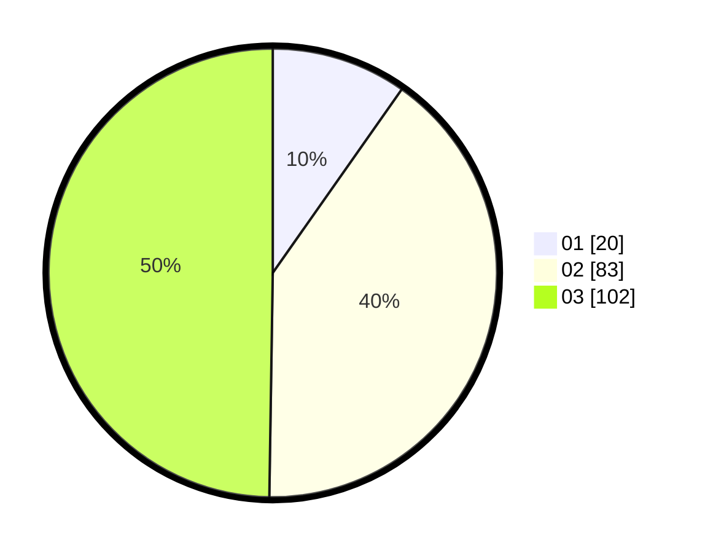

# Hasil

Hasil perolehan suara paslon dapat dilihat pada file paslon-01.txt, paslon-02.txt, dan paslon-03.txt.

Jika tidak ada, artinya data tersebut belum ada pada SIREKAP.

## Perolehan Suara

 * Paslon 01: **20**.
 * Paslon 02: **83**.
 * Paslon 03: **102**.

## Foto C Plano

https://sirekap-obj-formc.kpu.go.id/b756/pemilu/ppwp/31/73/04/10/01/3173041001010-20240214-200623--96527ac7-a628-4200-8325-82092be56082.jpg

https://sirekap-obj-formc.kpu.go.id/b756/pemilu/ppwp/31/73/04/10/01/3173041001010-20240214-201101--f9d3d81f-21ac-4b6d-8fe5-c387f276e7b5.jpg

https://sirekap-obj-formc.kpu.go.id/b756/pemilu/ppwp/31/73/04/10/01/3173041001010-20240214-201258--ef2fc2fc-663f-48d4-bee5-6ace559fac96.jpg

## DATA PEMILIH TETAP

Jumlah pemilih dalam DPT: **260**.
 * L: **119**.
 * P: **141**.

## DATA PENGGUNA HAK PILIH

Jumlah pengguna hak pilih dalam DPT: **204**.
 * L: **98**.
 * P: **106**.

Jumlah pengguna hak pilih dalam DPTb: **0**.
 * L: **0**.
 * P: **0**.

Jumlah pengguna hak pilih dalam DPK: **1**.
 * L: **1**.
 * P: **0**.

Jumlah pengguna hak pilih: **205**.
 * L: **99**.
 * P: **106**.

## JUMLAH SUARA SAH DAN TIDAK SAH

JUMLAH SELURUH SUARA SAH: **205**.

JUMLAH SUARA TIDAK SAH: **0**.

JUMLAH SELURUH SUARA SAH DAN SUARA TIDAK SAH: **205**.
