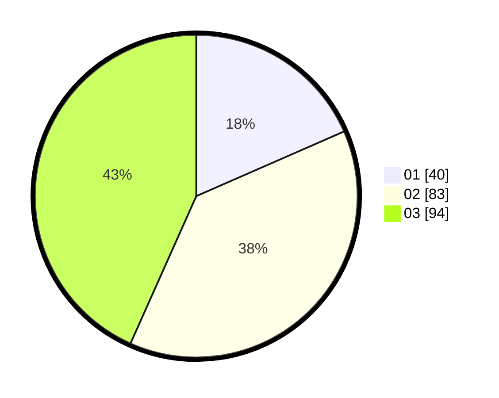

# Hasil

Hasil perolehan suara paslon dapat dilihat pada file paslon-01.txt, paslon-02.txt, dan paslon-03.txt.

Jika tidak ada, artinya data tersebut belum ada pada SIREKAP.

## Perolehan Suara

 * Paslon 01: **40**.
 * Paslon 02: **83**.
 * Paslon 03: **94**.

## Foto C Plano

https://sirekap-obj-formc.kpu.go.id/f692/pemilu/ppwp/31/73/04/10/01/3173041001011-20240214-180915--6f3b7337-6932-4d3f-8423-5c7a764d320e.jpg

https://sirekap-obj-formc.kpu.go.id/f692/pemilu/ppwp/31/73/04/10/01/3173041001011-20240214-190037--7ef58039-7f6d-4e25-8901-5da536aa7ce9.jpg

https://sirekap-obj-formc.kpu.go.id/f692/pemilu/ppwp/31/73/04/10/01/3173041001011-20240214-190210--25e64834-7f1f-42fc-aa69-349261a49c5d.jpg

## DATA PEMILIH TETAP

Jumlah pemilih dalam DPT: **279**.
 * L: **132**.
 * P: **147**.

## DATA PENGGUNA HAK PILIH

Jumlah pengguna hak pilih dalam DPT: **214**.
 * L: **103**.
 * P: **111**.

Jumlah pengguna hak pilih dalam DPTb: **2**.
 * L: **1**.
 * P: **1**.

Jumlah pengguna hak pilih dalam DPK: **3**.
 * L: **0**.
 * P: **3**.

Jumlah pengguna hak pilih: **219**.
 * L: **104**.
 * P: **115**.

## JUMLAH SUARA SAH DAN TIDAK SAH

JUMLAH SELURUH SUARA SAH: **217**.

JUMLAH SUARA TIDAK SAH: **2**.

JUMLAH SELURUH SUARA SAH DAN SUARA TIDAK SAH: **219**.
