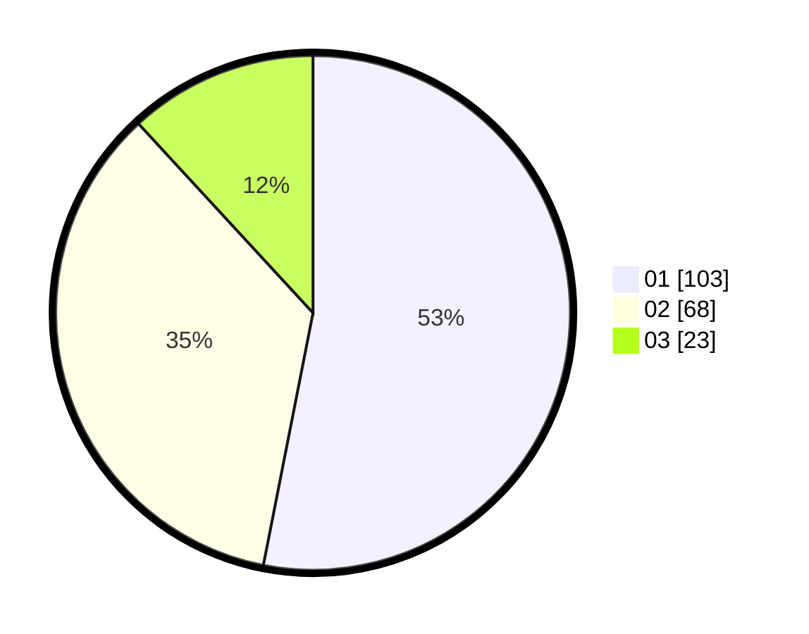

# Hasil

Hasil perolehan suara paslon dapat dilihat pada file paslon-01.txt, paslon-02.txt, dan paslon-03.txt.

Jika tidak ada, artinya data tersebut belum ada pada SIREKAP.

## Perolehan Suara

 * Paslon 01: **103**.
 * Paslon 02: **68**.
 * Paslon 03: **23**.

## Foto C Plano

https://sirekap-obj-formc.kpu.go.id/8092/pemilu/ppwp/31/73/04/10/01/3173041001014-20240215-183355--59344cd9-cab2-4007-a088-6be889c4edee.jpg

https://sirekap-obj-formc.kpu.go.id/8092/pemilu/ppwp/31/73/04/10/01/3173041001014-20240215-183513--7582a941-e43c-4313-9aa5-a88d486939e3.jpg

https://sirekap-obj-formc.kpu.go.id/8092/pemilu/ppwp/31/73/04/10/01/3173041001014-20240215-154240--509f384e-7094-49b5-bf2c-30ed72e28036.jpg
