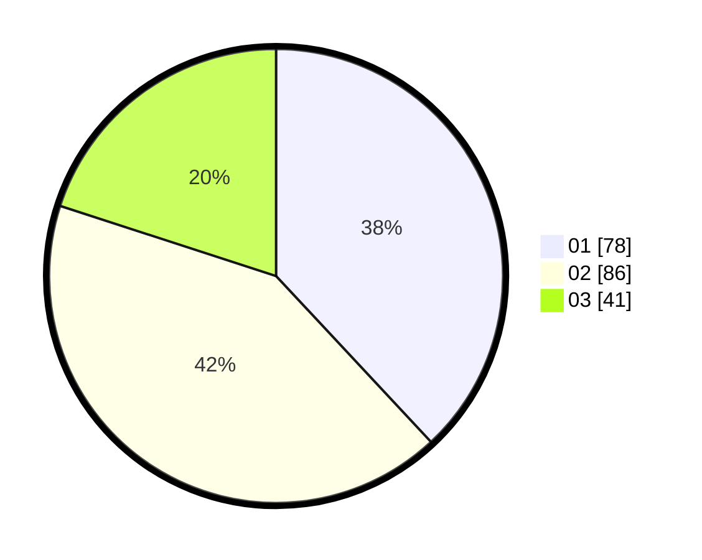

# Hasil

Hasil perolehan suara paslon dapat dilihat pada file paslon-01.txt, paslon-02.txt, dan paslon-03.txt.

Jika tidak ada, artinya data tersebut belum ada pada SIREKAP.

## Perolehan Suara

 * Paslon 01: **78**.
 * Paslon 02: **86**.
 * Paslon 03: **41**.

## Foto C Plano

https://sirekap-obj-formc.kpu.go.id/3324/pemilu/ppwp/31/73/04/10/01/3173041001016-20240214-221401--0162961d-4109-47e2-a157-1cd4e22efa29.jpg

https://sirekap-obj-formc.kpu.go.id/3324/pemilu/ppwp/31/73/04/10/01/3173041001016-20240214-221312--eee41cfc-1150-4319-90da-45eccc1eef26.jpg

https://sirekap-obj-formc.kpu.go.id/3324/pemilu/ppwp/31/73/04/10/01/3173041001016-20240214-221124--0761f17b-f06b-408c-9779-b85b9907cc7e.jpg
