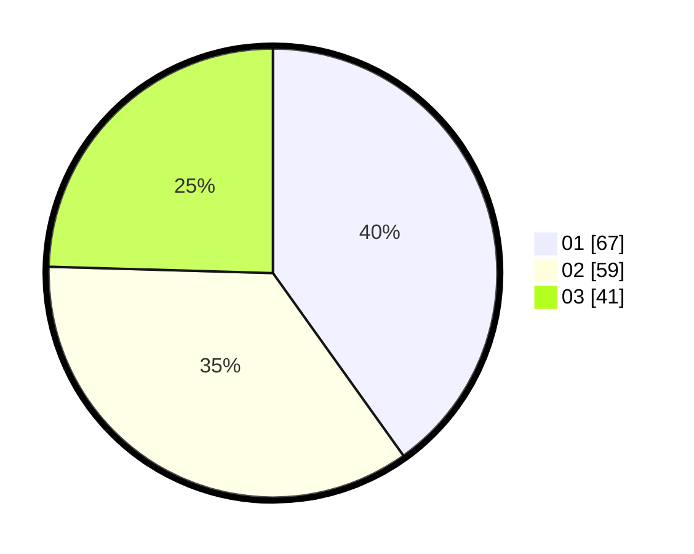

# Hasil

Hasil perolehan suara paslon dapat dilihat pada file paslon-01.txt, paslon-02.txt, dan paslon-03.txt.

Jika tidak ada, artinya data tersebut belum ada pada SIREKAP.

## Perolehan Suara

 * Paslon 01: **67**.
 * Paslon 02: **59**.
 * Paslon 03: **41**.

## Foto C Plano

https://sirekap-obj-formc.kpu.go.id/2ec1/pemilu/ppwp/31/73/04/10/01/3173041001022-20240214-221652--d4f38464-f61c-415c-accc-9b683a4899a9.jpg

https://sirekap-obj-formc.kpu.go.id/2ec1/pemilu/ppwp/31/73/04/10/01/3173041001022-20240214-221832--f9fee267-0b45-46b7-8b1d-c4f9672edc8e.jpg

https://sirekap-obj-formc.kpu.go.id/2ec1/pemilu/ppwp/31/73/04/10/01/3173041001022-20240214-222000--0af73e5a-8de8-4056-9415-c2a25fccd65f.jpg

## DATA PEMILIH TETAP

Jumlah pemilih dalam DPT: **250**.
 * L: **132**.
 * P: **118**.

## DATA PENGGUNA HAK PILIH

Jumlah pengguna hak pilih dalam DPT: **168**.
 * L: **91**.
 * P: **77**.

Jumlah pengguna hak pilih dalam DPTb: **1**.
 * L: **0**.
 * P: **1**.

Jumlah pengguna hak pilih dalam DPK: **2**.
 * L: **0**.
 * P: **2**.

Jumlah pengguna hak pilih: **171**.
 * L: **91**.
 * P: **80**.

## JUMLAH SUARA SAH DAN TIDAK SAH

JUMLAH SELURUH SUARA SAH: **167**.

JUMLAH SUARA TIDAK SAH: **4**.

JUMLAH SELURUH SUARA SAH DAN SUARA TIDAK SAH: **171**.
