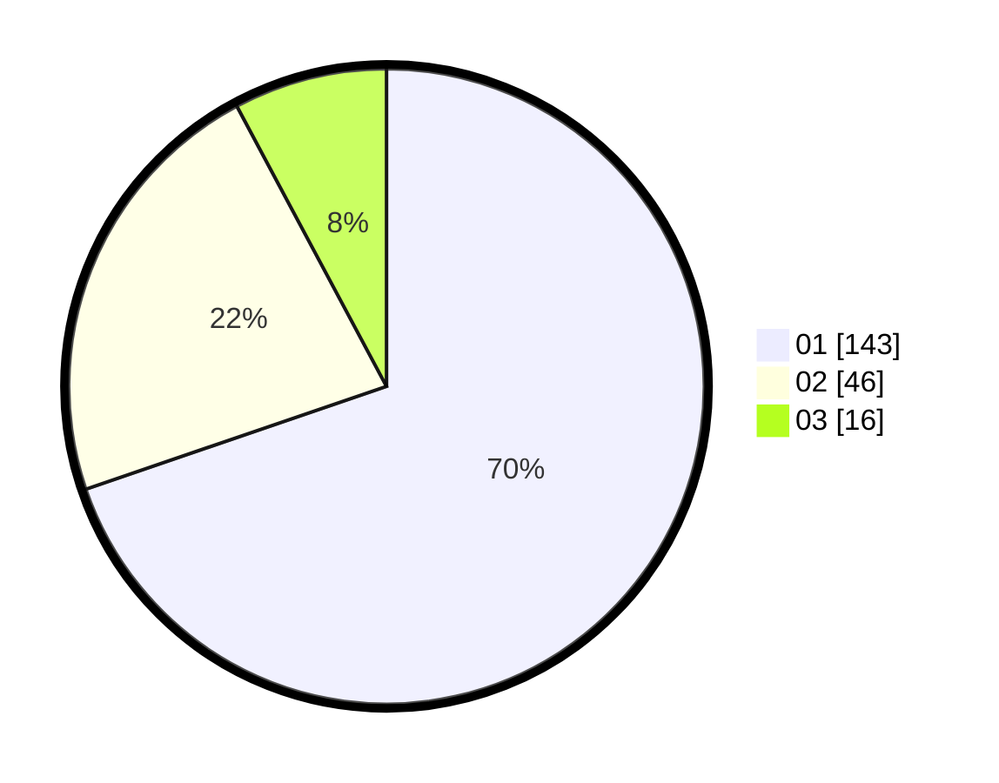

# Hasil

Hasil perolehan suara paslon dapat dilihat pada file paslon-01.txt, paslon-02.txt, dan paslon-03.txt.

Jika tidak ada, artinya data tersebut belum ada pada SIREKAP.

## Perolehan Suara

 * Paslon 01: **143**.
 * Paslon 02: **46**.
 * Paslon 03: **16**.

## Foto C Plano

https://sirekap-obj-formc.kpu.go.id/14de/pemilu/ppwp/31/73/04/10/01/3173041001025-20240214-222640--460e3050-d188-4fb4-ac1b-b323e33ca240.jpg

https://sirekap-obj-formc.kpu.go.id/14de/pemilu/ppwp/31/73/04/10/01/3173041001025-20240214-222839--244d3ca3-a2d6-4470-8345-e580f91d56f0.jpg

https://sirekap-obj-formc.kpu.go.id/14de/pemilu/ppwp/31/73/04/10/01/3173041001025-20240214-222935--eace55ae-32d1-4eb3-9f21-0c3f9705dc70.jpg
