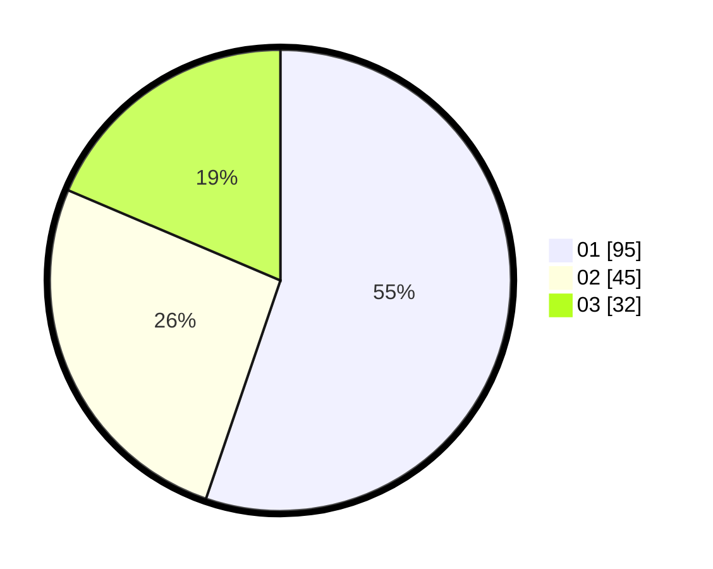

# Hasil

Hasil perolehan suara paslon dapat dilihat pada file paslon-01.txt, paslon-02.txt, dan paslon-03.txt.

Jika tidak ada, artinya data tersebut belum ada pada SIREKAP.

## Perolehan Suara

 * Paslon 01: **95**.
 * Paslon 02: **45**.
 * Paslon 03: **32**.

## Foto C Plano

https://sirekap-obj-formc.kpu.go.id/e88e/pemilu/ppwp/31/73/04/10/01/3173041001027-20240215-005334--9bdf8098-af80-4fd7-afc3-05adb977a725.jpg

https://sirekap-obj-formc.kpu.go.id/e88e/pemilu/ppwp/31/73/04/10/01/3173041001027-20240215-005340--239c3be8-2486-4fa8-abb7-149a5fdd1930.jpg

https://sirekap-obj-formc.kpu.go.id/e88e/pemilu/ppwp/31/73/04/10/01/3173041001027-20240215-005323--28b944b0-f579-4c06-9a9c-a87c6edc923a.jpg
