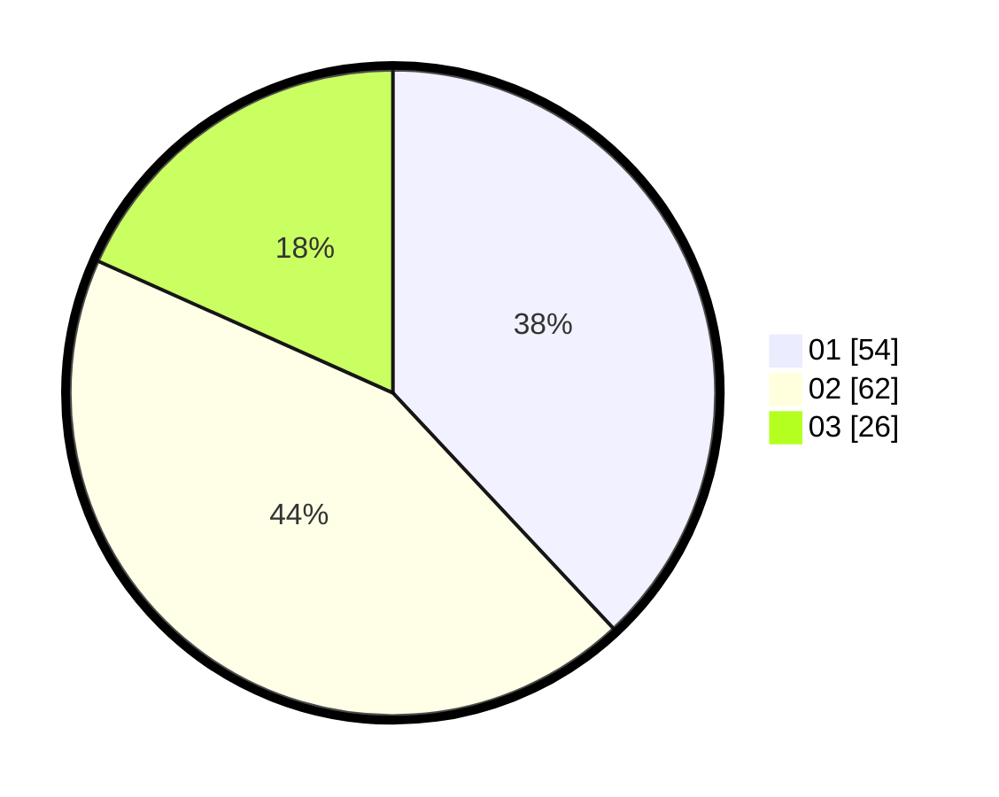

# Hasil

Hasil perolehan suara paslon dapat dilihat pada file paslon-01.txt, paslon-02.txt, dan paslon-03.txt.

Jika tidak ada, artinya data tersebut belum ada pada SIREKAP.

## Perolehan Suara

 * Paslon 01: **54**.
 * Paslon 02: **62**.
 * Paslon 03: **26**.

## Foto C Plano

https://sirekap-obj-formc.kpu.go.id/fd8e/pemilu/ppwp/31/73/04/10/01/3173041001031-20240214-184509--09882540-9bb0-4950-818b-8d9b3163dd79.jpg

https://sirekap-obj-formc.kpu.go.id/fd8e/pemilu/ppwp/31/73/04/10/01/3173041001031-20240214-184451--907afe42-aa19-40e7-8b36-8e7a62a8de4d.jpg

https://sirekap-obj-formc.kpu.go.id/fd8e/pemilu/ppwp/31/73/04/10/01/3173041001031-20240214-184659--a52d999a-f1e3-48df-a7cc-749d89606e88.jpg

## DATA PEMILIH TETAP

Jumlah pemilih dalam DPT: **208**.
 * L: **106**.
 * P: **102**.

## DATA PENGGUNA HAK PILIH

Jumlah pengguna hak pilih dalam DPT: **141**.
 * L: **68**.
 * P: **73**.

Jumlah pengguna hak pilih dalam DPTb: **1**.
 * L: **1**.
 * P: **0**.

Jumlah pengguna hak pilih dalam DPK: **0**.
 * L: **0**.
 * P: **0**.

Jumlah pengguna hak pilih: **142**.
 * L: **69**.
 * P: **73**.

## JUMLAH SUARA SAH DAN TIDAK SAH

JUMLAH SELURUH SUARA SAH: **142**.

JUMLAH SUARA TIDAK SAH: **0**.

JUMLAH SELURUH SUARA SAH DAN SUARA TIDAK SAH: **142**.
