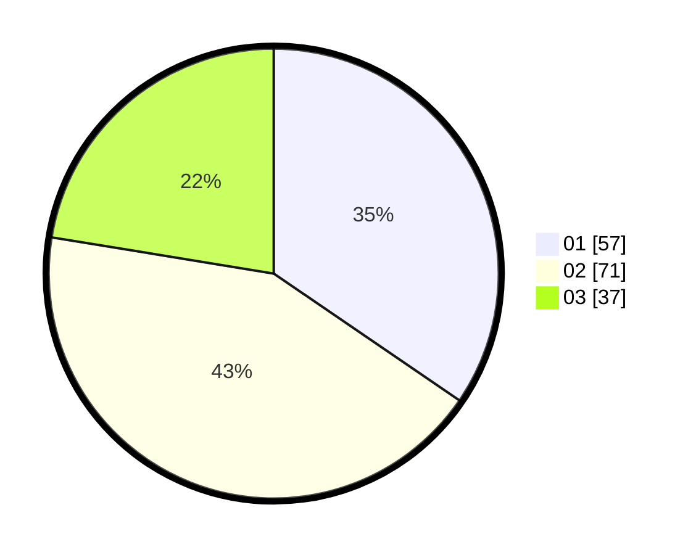

# Hasil

Hasil perolehan suara paslon dapat dilihat pada file paslon-01.txt, paslon-02.txt, dan paslon-03.txt.

Jika tidak ada, artinya data tersebut belum ada pada SIREKAP.

## Perolehan Suara

 * Paslon 01: **57**.
 * Paslon 02: **71**.
 * Paslon 03: **37**.

## Foto C Plano

https://sirekap-obj-formc.kpu.go.id/c9e2/pemilu/ppwp/31/73/04/10/01/3173041001033-20240215-023338--e02713ad-9caf-4bfc-ad7e-e8df1af7601e.jpg

https://sirekap-obj-formc.kpu.go.id/c9e2/pemilu/ppwp/31/73/04/10/01/3173041001033-20240215-024043--1a5f8d57-4c7c-40a2-9f53-98336336977a.jpg

https://sirekap-obj-formc.kpu.go.id/c9e2/pemilu/ppwp/31/73/04/10/01/3173041001033-20240215-021207--5b3056c4-b168-4503-9190-dba3fa701cca.jpg
