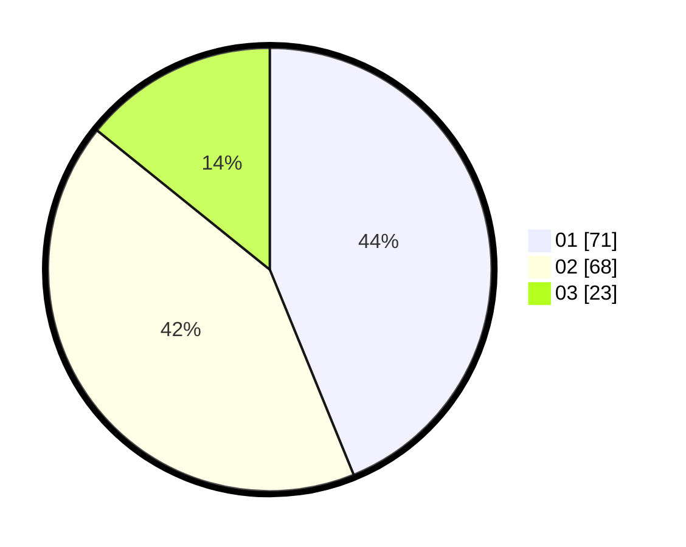

# Hasil

Hasil perolehan suara paslon dapat dilihat pada file paslon-01.txt, paslon-02.txt, dan paslon-03.txt.

Jika tidak ada, artinya data tersebut belum ada pada SIREKAP.

## Perolehan Suara

 * Paslon 01: **71**.
 * Paslon 02: **68**.
 * Paslon 03: **23**.

## Foto C Plano

https://sirekap-obj-formc.kpu.go.id/8449/pemilu/ppwp/31/73/04/10/01/3173041001036-20240216-194252--8bf6eb3f-2c42-4808-80d5-362a718a5936.jpg

https://sirekap-obj-formc.kpu.go.id/8449/pemilu/ppwp/31/73/04/10/01/3173041001036-20240216-200354--565625e7-999a-4d18-b5d0-be632cf6092d.jpg

https://sirekap-obj-formc.kpu.go.id/8449/pemilu/ppwp/31/73/04/10/01/3173041001036-20240216-195152--9a73b90c-f9b9-4bfe-967e-2d9ac84b1258.jpg

## DATA PEMILIH TETAP

Jumlah pemilih dalam DPT: **248**.
 * L: **123**.
 * P: **120**.

## DATA PENGGUNA HAK PILIH

Jumlah pengguna hak pilih dalam DPT: **164**.
 * L: **81**.
 * P: **83**.

Jumlah pengguna hak pilih dalam DPTb: **2**.
 * L: **0**.
 * P: **2**.

Jumlah pengguna hak pilih dalam DPK: **1**.
 * L: **1**.
 * P: **0**.

Jumlah pengguna hak pilih: **167**.
 * L: **82**.
 * P: **85**.

## JUMLAH SUARA SAH DAN TIDAK SAH

JUMLAH SELURUH SUARA SAH: **162**.

JUMLAH SUARA TIDAK SAH: **5**.

JUMLAH SELURUH SUARA SAH DAN SUARA TIDAK SAH: **167**.
