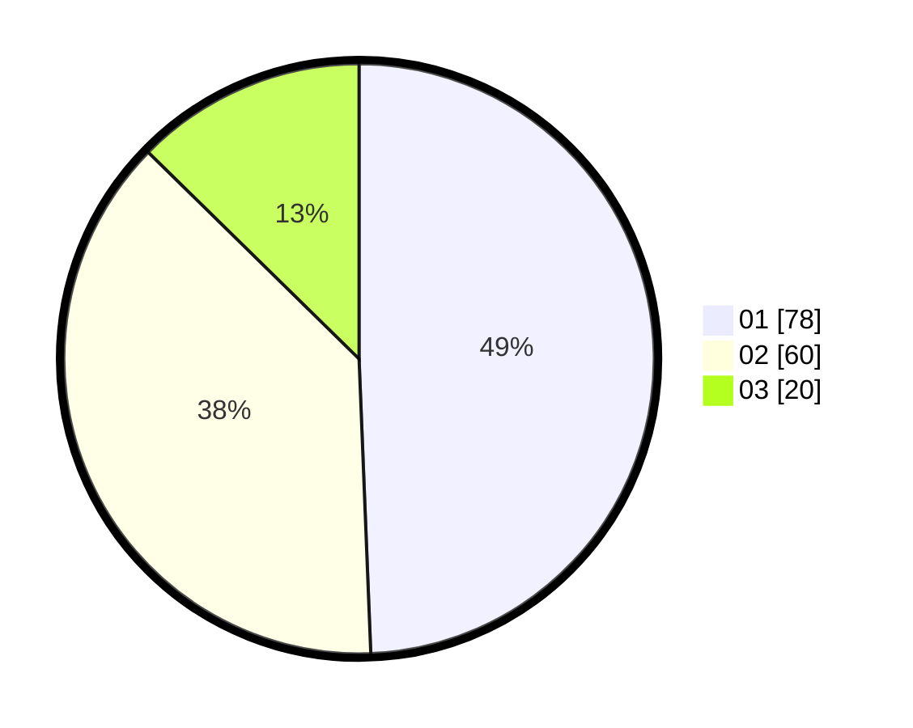

# Hasil

Hasil perolehan suara paslon dapat dilihat pada file paslon-01.txt, paslon-02.txt, dan paslon-03.txt.

Jika tidak ada, artinya data tersebut belum ada pada SIREKAP.

## Perolehan Suara

 * Paslon 01: **78**.
 * Paslon 02: **60**.
 * Paslon 03: **20**.

## Foto C Plano

https://sirekap-obj-formc.kpu.go.id/3b76/pemilu/ppwp/31/73/04/10/01/3173041001037-20240214-223909--d7d01b84-94c1-4331-bb3b-41a2a8725207.jpg

https://sirekap-obj-formc.kpu.go.id/3b76/pemilu/ppwp/31/73/04/10/01/3173041001037-20240214-223915--8d2c54a2-544a-4f7e-a1fd-5aab2788e370.jpg

https://sirekap-obj-formc.kpu.go.id/3b76/pemilu/ppwp/31/73/04/10/01/3173041001037-20240214-223924--132fda17-f030-4e73-9453-446fc8da2374.jpg
