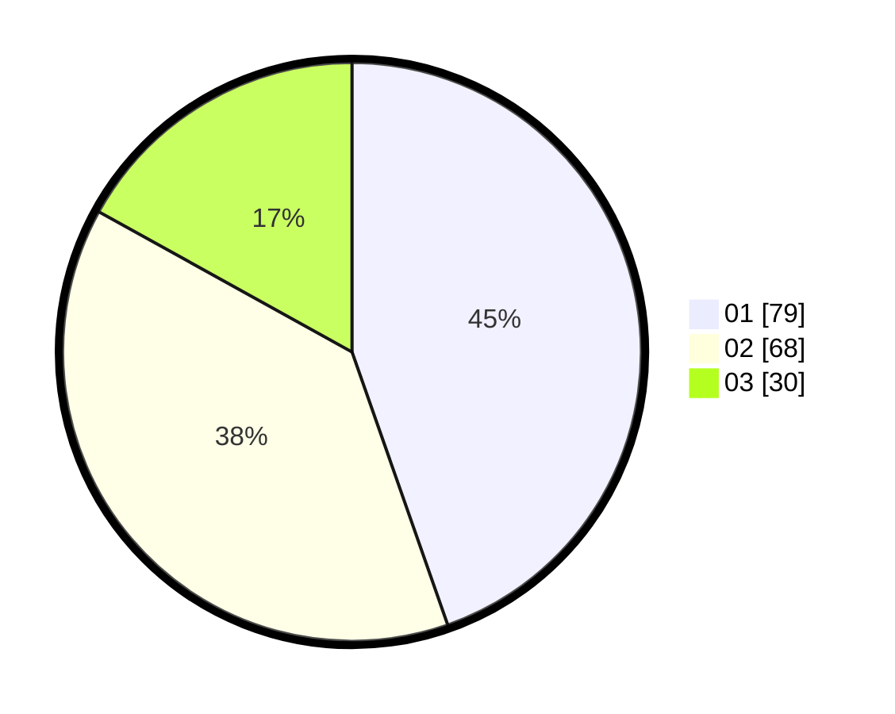

# Hasil

Hasil perolehan suara paslon dapat dilihat pada file paslon-01.txt, paslon-02.txt, dan paslon-03.txt.

Jika tidak ada, artinya data tersebut belum ada pada SIREKAP.

## Perolehan Suara

 * Paslon 01: **79**.
 * Paslon 02: **68**.
 * Paslon 03: **30**.

## Foto C Plano

https://sirekap-obj-formc.kpu.go.id/0035/pemilu/ppwp/31/73/04/10/02/3173041002002-20240216-015029--7c837836-41bb-42e0-885f-fc0634f807bf.jpg

https://sirekap-obj-formc.kpu.go.id/0035/pemilu/ppwp/31/73/04/10/02/3173041002002-20240216-011804--8d085edf-0f75-49a4-b949-6a653309db0c.jpg

https://sirekap-obj-formc.kpu.go.id/0035/pemilu/ppwp/31/73/04/10/02/3173041002002-20240216-011756--3601bd2a-fa9e-4cff-9954-0f811cbc1f32.jpg

## DATA PEMILIH TETAP

Jumlah pemilih dalam DPT: **248**.
 * L: **126**.
 * P: **122**.

## DATA PENGGUNA HAK PILIH

Jumlah pengguna hak pilih dalam DPT: **176**.
 * L: **90**.
 * P: **86**.

Jumlah pengguna hak pilih dalam DPTb: **0**.
 * L: **0**.
 * P: **0**.

Jumlah pengguna hak pilih dalam DPK: **4**.
 * L: **2**.
 * P: **2**.

Jumlah pengguna hak pilih: **180**.
 * L: **92**.
 * P: **88**.

## JUMLAH SUARA SAH DAN TIDAK SAH

JUMLAH SELURUH SUARA SAH: **177**.

JUMLAH SUARA TIDAK SAH: **3**.

JUMLAH SELURUH SUARA SAH DAN SUARA TIDAK SAH: **180**.
