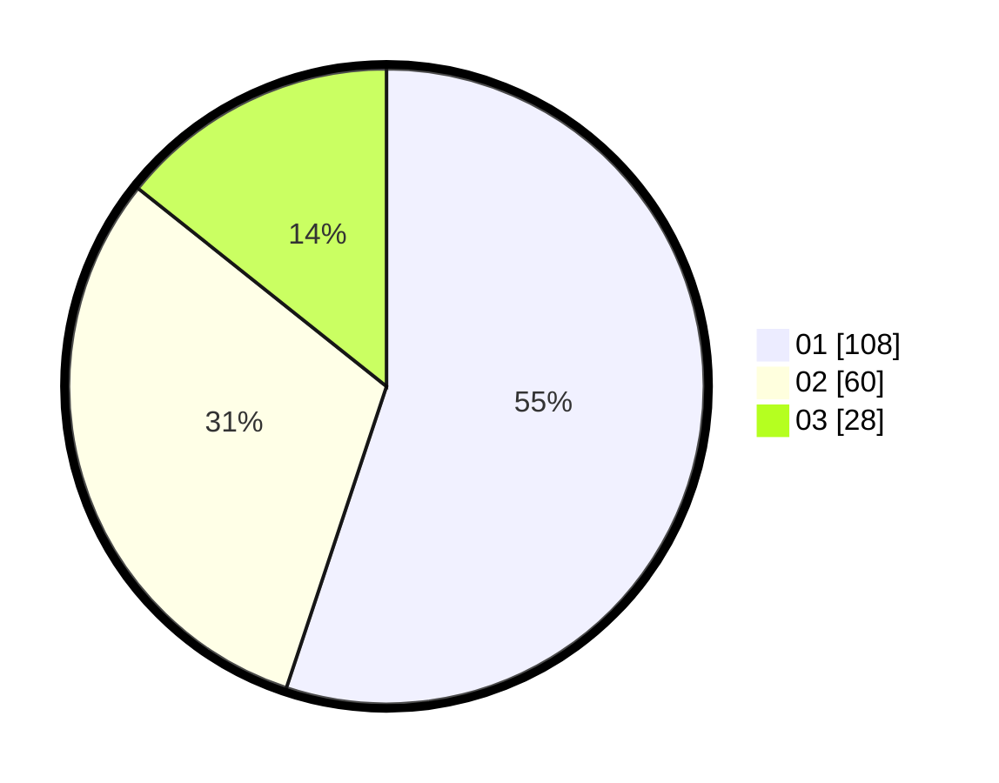

# Hasil

Hasil perolehan suara paslon dapat dilihat pada file paslon-01.txt, paslon-02.txt, dan paslon-03.txt.

Jika tidak ada, artinya data tersebut belum ada pada SIREKAP.

## Perolehan Suara

 * Paslon 01: **108**.
 * Paslon 02: **60**.
 * Paslon 03: **28**.

## Foto C Plano

https://sirekap-obj-formc.kpu.go.id/c18c/pemilu/ppwp/31/73/04/10/02/3173041002005-20240216-144212--6e2f8d53-669e-4f8b-bd14-f81d79d30c10.jpg

https://sirekap-obj-formc.kpu.go.id/c18c/pemilu/ppwp/31/73/04/10/02/3173041002005-20240216-144212--4d5583f4-8371-4af2-bff0-01c9661ae41f.jpg

https://sirekap-obj-formc.kpu.go.id/c18c/pemilu/ppwp/31/73/04/10/02/3173041002005-20240215-012056--bad84731-bb94-415c-84c0-18a0562b89ee.jpg

## DATA PEMILIH TETAP

Jumlah pemilih dalam DPT: **265**.
 * L: **139**.
 * P: **126**.

## DATA PENGGUNA HAK PILIH

Jumlah pengguna hak pilih dalam DPT: **196**.
 * L: **104**.
 * P: **92**.

Jumlah pengguna hak pilih dalam DPTb: **0**.
 * L: **0**.
 * P: **0**.

Jumlah pengguna hak pilih dalam DPK: **1**.
 * L: **1**.
 * P: **0**.

Jumlah pengguna hak pilih: **197**.
 * L: **105**.
 * P: **92**.

## JUMLAH SUARA SAH DAN TIDAK SAH

JUMLAH SELURUH SUARA SAH: **196**.

JUMLAH SUARA TIDAK SAH: **1**.

JUMLAH SELURUH SUARA SAH DAN SUARA TIDAK SAH: **197**.
