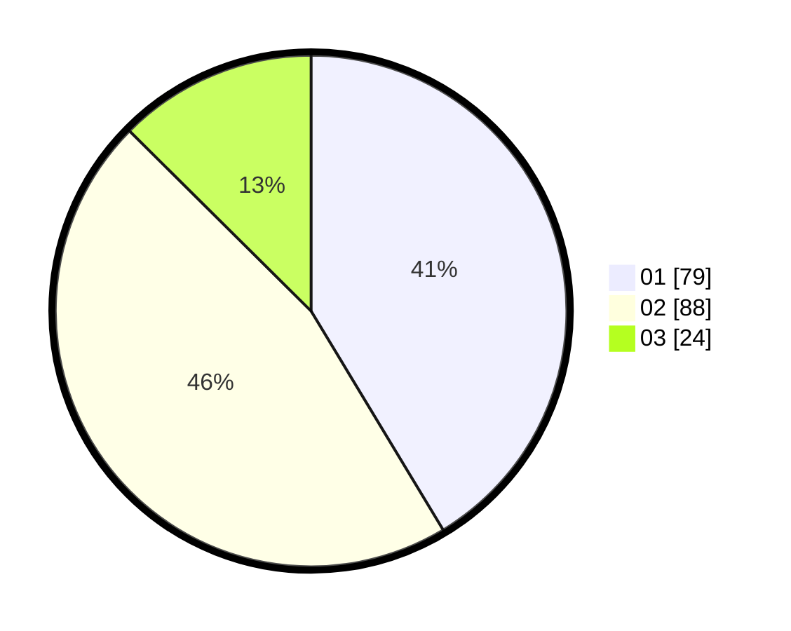

# Hasil

Hasil perolehan suara paslon dapat dilihat pada file paslon-01.txt, paslon-02.txt, dan paslon-03.txt.

Jika tidak ada, artinya data tersebut belum ada pada SIREKAP.

## Perolehan Suara

 * Paslon 01: **79**.
 * Paslon 02: **88**.
 * Paslon 03: **24**.

## Foto C Plano

https://sirekap-obj-formc.kpu.go.id/7ef4/pemilu/ppwp/31/73/04/10/02/3173041002008-20240214-185820--28be9417-2c78-4c04-811b-76e350f1ed5d.jpg

https://sirekap-obj-formc.kpu.go.id/7ef4/pemilu/ppwp/31/73/04/10/02/3173041002008-20240214-185245--482a0f45-193c-4175-9079-4bd8306bce4d.jpg

https://sirekap-obj-formc.kpu.go.id/7ef4/pemilu/ppwp/31/73/04/10/02/3173041002008-20240214-185446--b85bd7eb-fb3a-40d0-af42-cabeacb7d2e3.jpg

## DATA PEMILIH TETAP

Jumlah pemilih dalam DPT: **248**.
 * L: **123**.
 * P: **125**.

## DATA PENGGUNA HAK PILIH

Jumlah pengguna hak pilih dalam DPT: **191**.
 * L: **90**.
 * P: **101**.

Jumlah pengguna hak pilih dalam DPTb: **0**.
 * L: **0**.
 * P: **0**.

Jumlah pengguna hak pilih dalam DPK: **3**.
 * L: **0**.
 * P: **3**.

Jumlah pengguna hak pilih: **194**.
 * L: **90**.
 * P: **104**.

## JUMLAH SUARA SAH DAN TIDAK SAH

JUMLAH SELURUH SUARA SAH: **191**.

JUMLAH SUARA TIDAK SAH: **3**.

JUMLAH SELURUH SUARA SAH DAN SUARA TIDAK SAH: **194**.
