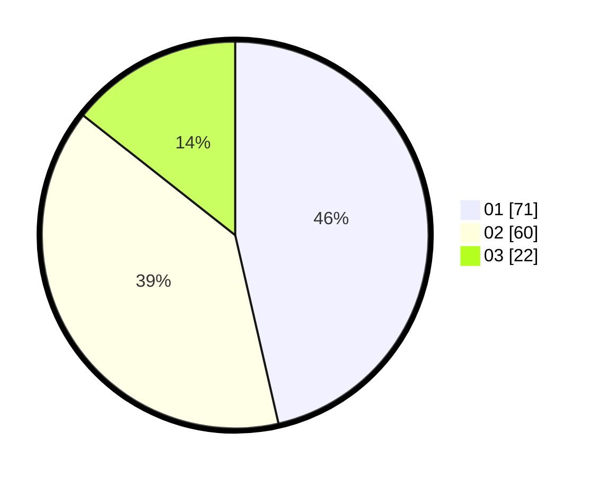

# Hasil

Hasil perolehan suara paslon dapat dilihat pada file paslon-01.txt, paslon-02.txt, dan paslon-03.txt.

Jika tidak ada, artinya data tersebut belum ada pada SIREKAP.

## Perolehan Suara

 * Paslon 01: **71**.
 * Paslon 02: **60**.
 * Paslon 03: **22**.

## Foto C Plano

https://sirekap-obj-formc.kpu.go.id/d7a0/pemilu/ppwp/31/73/04/10/02/3173041002009-20240214-191250--b435dff5-ebf4-429f-ac5b-1fec7ac3fa43.jpg

https://sirekap-obj-formc.kpu.go.id/d7a0/pemilu/ppwp/31/73/04/10/02/3173041002009-20240214-212437--26ab248f-2603-459a-bcd4-1aeead5e33d9.jpg

https://sirekap-obj-formc.kpu.go.id/d7a0/pemilu/ppwp/31/73/04/10/02/3173041002009-20240214-195737--620831c0-6d1b-4d70-b384-2cda6bebd6a3.jpg

## DATA PEMILIH TETAP

Jumlah pemilih dalam DPT: **155**.
 * L: **83**.
 * P: **72**.

## DATA PENGGUNA HAK PILIH

Jumlah pengguna hak pilih dalam DPT: **154**.
 * L: **82**.
 * P: **72**.

Jumlah pengguna hak pilih dalam DPTb: **0**.
 * L: **0**.
 * P: **0**.

Jumlah pengguna hak pilih dalam DPK: **1**.
 * L: **1**.
 * P: **0**.

Jumlah pengguna hak pilih: **155**.
 * L: **83**.
 * P: **72**.

## JUMLAH SUARA SAH DAN TIDAK SAH

JUMLAH SELURUH SUARA SAH: **153**.

JUMLAH SUARA TIDAK SAH: **2**.

JUMLAH SELURUH SUARA SAH DAN SUARA TIDAK SAH: **155**.
