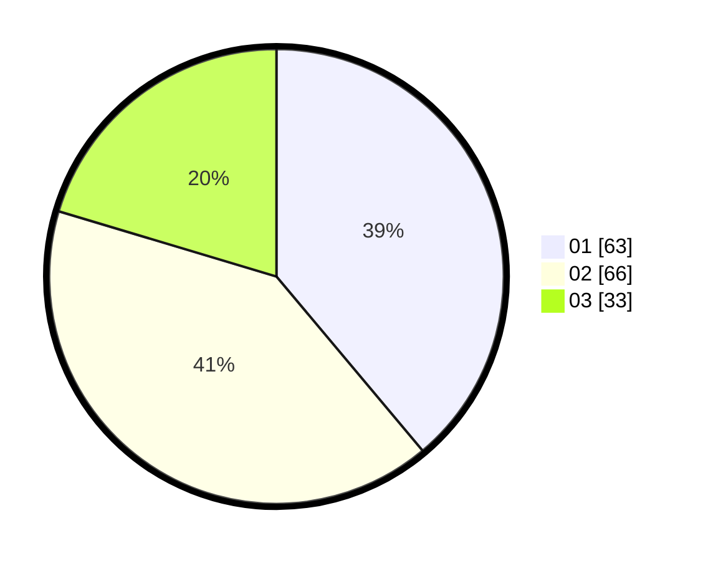

# Hasil

Hasil perolehan suara paslon dapat dilihat pada file paslon-01.txt, paslon-02.txt, dan paslon-03.txt.

Jika tidak ada, artinya data tersebut belum ada pada SIREKAP.

## Perolehan Suara

 * Paslon 01: **63**.
 * Paslon 02: **66**.
 * Paslon 03: **33**.

## Foto C Plano

https://sirekap-obj-formc.kpu.go.id/9689/pemilu/ppwp/31/73/04/10/02/3173041002010-20240216-062744--6dfab02e-06a3-464f-ae4c-5233c62b4483.jpg

https://sirekap-obj-formc.kpu.go.id/9689/pemilu/ppwp/31/73/04/10/02/3173041002010-20240216-062745--c6ba0d37-d0c3-491f-8daf-df5b40ce25d4.jpg

https://sirekap-obj-formc.kpu.go.id/9689/pemilu/ppwp/31/73/04/10/02/3173041002010-20240216-062745--027a7b8a-e691-4045-ae64-019dd96c7a5c.jpg

## DATA PEMILIH TETAP

Jumlah pemilih dalam DPT: **239**.
 * L: **125**.
 * P: **114**.

## DATA PENGGUNA HAK PILIH

Jumlah pengguna hak pilih dalam DPT: **167**.
 * L: **89**.
 * P: **78**.

Jumlah pengguna hak pilih dalam DPTb: **0**.
 * L: **0**.
 * P: **0**.

Jumlah pengguna hak pilih dalam DPK: **2**.
 * L: **1**.
 * P: **1**.

Jumlah pengguna hak pilih: **169**.
 * L: **90**.
 * P: **79**.

## JUMLAH SUARA SAH DAN TIDAK SAH

JUMLAH SELURUH SUARA SAH: **162**.

JUMLAH SUARA TIDAK SAH: **7**.

JUMLAH SELURUH SUARA SAH DAN SUARA TIDAK SAH: **169**.
