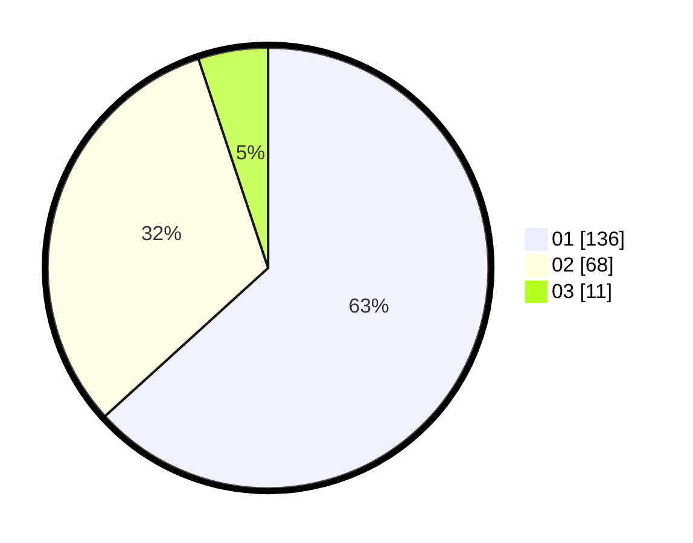

# Hasil

Hasil perolehan suara paslon dapat dilihat pada file paslon-01.txt, paslon-02.txt, dan paslon-03.txt.

Jika tidak ada, artinya data tersebut belum ada pada SIREKAP.

## Perolehan Suara

 * Paslon 01: **136**.
 * Paslon 02: **68**.
 * Paslon 03: **11**.

## Foto C Plano

https://sirekap-obj-formc.kpu.go.id/ef87/pemilu/ppwp/31/73/04/10/02/3173041002013-20240216-062359--28001c69-fcf4-472f-bcf1-f3dc4e4ad2fb.jpg

https://sirekap-obj-formc.kpu.go.id/ef87/pemilu/ppwp/31/73/04/10/02/3173041002013-20240216-062402--92d94f11-1ee0-4b6e-838d-12e472bd88c3.jpg

https://sirekap-obj-formc.kpu.go.id/ef87/pemilu/ppwp/31/73/04/10/02/3173041002013-20240216-062401--8af08966-e1b1-42ae-95b8-de546910a693.jpg

## DATA PEMILIH TETAP

Jumlah pemilih dalam DPT: **261**.
 * L: **128**.
 * P: **133**.

## DATA PENGGUNA HAK PILIH

Jumlah pengguna hak pilih dalam DPT: **210**.
 * L: **103**.
 * P: **107**.

Jumlah pengguna hak pilih dalam DPTb: **0**.
 * L: **0**.
 * P: **0**.

Jumlah pengguna hak pilih dalam DPK: **5**.
 * L: **3**.
 * P: **2**.

Jumlah pengguna hak pilih: **215**.
 * L: **106**.
 * P: **109**.

## JUMLAH SUARA SAH DAN TIDAK SAH

JUMLAH SELURUH SUARA SAH: **215**.

JUMLAH SUARA TIDAK SAH: **0**.

JUMLAH SELURUH SUARA SAH DAN SUARA TIDAK SAH: **215**.
