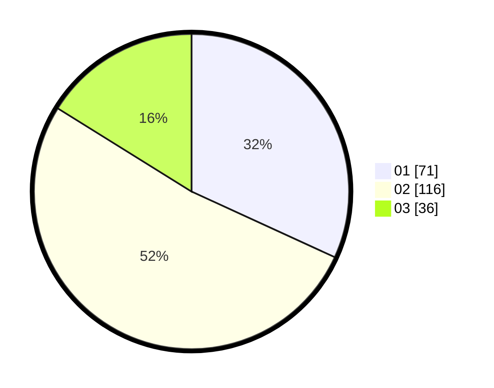

# Hasil

Hasil perolehan suara paslon dapat dilihat pada file paslon-01.txt, paslon-02.txt, dan paslon-03.txt.

Jika tidak ada, artinya data tersebut belum ada pada SIREKAP.

## Perolehan Suara

 * Paslon 01: **71**.
 * Paslon 02: **116**.
 * Paslon 03: **36**.

## Foto C Plano

https://sirekap-obj-formc.kpu.go.id/19f7/pemilu/ppwp/31/73/04/10/02/3173041002018-20240215-011416--ef7b4486-d82a-4d98-a59b-0703f1220454.jpg

https://sirekap-obj-formc.kpu.go.id/19f7/pemilu/ppwp/31/73/04/10/02/3173041002018-20240215-011451--bac5f7fb-4124-4348-ac7c-3c5199d969bb.jpg

https://sirekap-obj-formc.kpu.go.id/19f7/pemilu/ppwp/31/73/04/10/02/3173041002018-20240215-011619--774dbd04-faa9-43a1-afd5-da8f6c44ac2f.jpg
