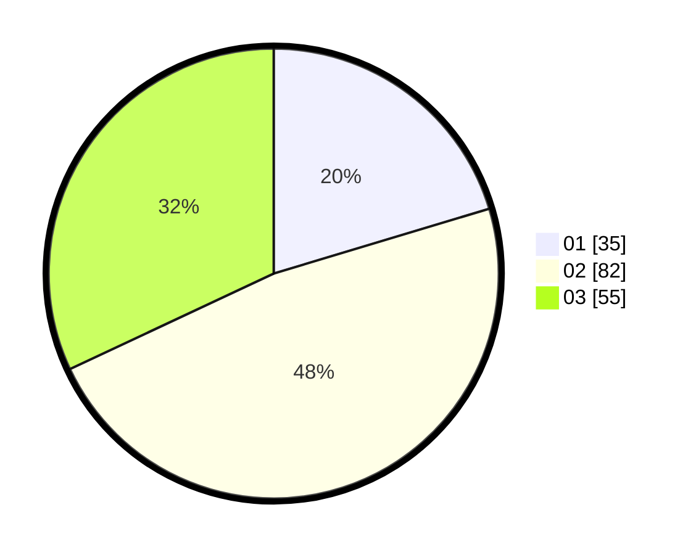

# Hasil

Hasil perolehan suara paslon dapat dilihat pada file paslon-01.txt, paslon-02.txt, dan paslon-03.txt.

Jika tidak ada, artinya data tersebut belum ada pada SIREKAP.

## Perolehan Suara

 * Paslon 01: **35**.
 * Paslon 02: **82**.
 * Paslon 03: **55**.

## Foto C Plano

https://sirekap-obj-formc.kpu.go.id/f39d/pemilu/ppwp/31/73/04/10/02/3173041002020-20240214-205314--e9494362-3ca3-4068-82e3-4db6a182bc6e.jpg

https://sirekap-obj-formc.kpu.go.id/f39d/pemilu/ppwp/31/73/04/10/02/3173041002020-20240214-205514--01004f81-a1d4-47fe-befd-5491c5e197c0.jpg

https://sirekap-obj-formc.kpu.go.id/f39d/pemilu/ppwp/31/73/04/10/02/3173041002020-20240214-202200--748f9251-68ba-4e63-a9f2-66dd33ecc55c.jpg

## DATA PEMILIH TETAP

Jumlah pemilih dalam DPT: **234**.
 * L: **118**.
 * P: **116**.

## DATA PENGGUNA HAK PILIH

Jumlah pengguna hak pilih dalam DPT: **173**.
 * L: **88**.
 * P: **85**.

Jumlah pengguna hak pilih dalam DPTb: **0**.
 * L: **0**.
 * P: **0**.

Jumlah pengguna hak pilih dalam DPK: **0**.
 * L: **0**.
 * P: **0**.

Jumlah pengguna hak pilih: **173**.
 * L: **88**.
 * P: **85**.

## JUMLAH SUARA SAH DAN TIDAK SAH

JUMLAH SELURUH SUARA SAH: **172**.

JUMLAH SUARA TIDAK SAH: **1**.

JUMLAH SELURUH SUARA SAH DAN SUARA TIDAK SAH: **173**.
