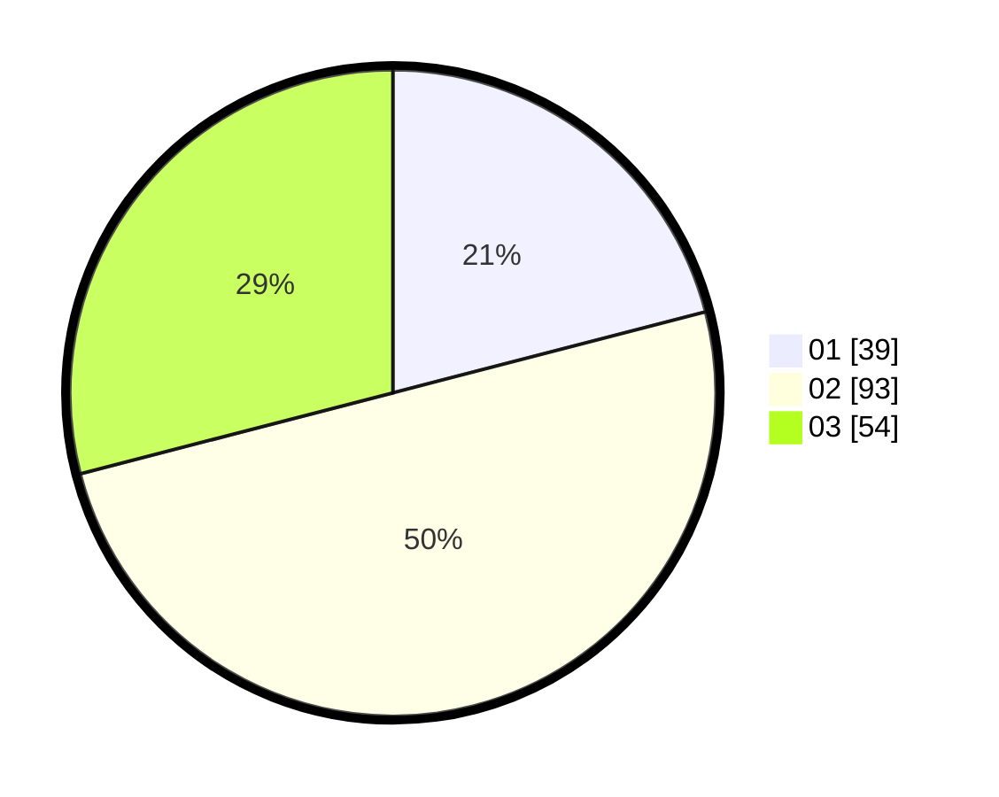

# Hasil

Hasil perolehan suara paslon dapat dilihat pada file paslon-01.txt, paslon-02.txt, dan paslon-03.txt.

Jika tidak ada, artinya data tersebut belum ada pada SIREKAP.

## Perolehan Suara

 * Paslon 01: **39**.
 * Paslon 02: **93**.
 * Paslon 03: **54**.

## Foto C Plano

https://sirekap-obj-formc.kpu.go.id/2a47/pemilu/ppwp/31/73/04/10/02/3173041002021-20240214-225107--b5f4b87d-d01e-40da-95b5-36e3db23e004.jpg

https://sirekap-obj-formc.kpu.go.id/2a47/pemilu/ppwp/31/73/04/10/02/3173041002021-20240216-124105--7f9ac8fc-37ca-4a78-98cc-d47c6b250ac4.jpg

https://sirekap-obj-formc.kpu.go.id/2a47/pemilu/ppwp/31/73/04/10/02/3173041002021-20240216-124104--9259a252-22e2-441c-9091-6f03d05ca720.jpg

## DATA PEMILIH TETAP

Jumlah pemilih dalam DPT: **239**.
 * L: **122**.
 * P: **117**.

## DATA PENGGUNA HAK PILIH

Jumlah pengguna hak pilih dalam DPT: **190**.
 * L: **96**.
 * P: **94**.

Jumlah pengguna hak pilih dalam DPTb: **0**.
 * L: **0**.
 * P: **0**.

Jumlah pengguna hak pilih dalam DPK: **0**.
 * L: **0**.
 * P: **0**.

Jumlah pengguna hak pilih: **190**.
 * L: **96**.
 * P: **94**.

## JUMLAH SUARA SAH DAN TIDAK SAH

JUMLAH SELURUH SUARA SAH: **186**.

JUMLAH SUARA TIDAK SAH: **4**.

JUMLAH SELURUH SUARA SAH DAN SUARA TIDAK SAH: **190**.
