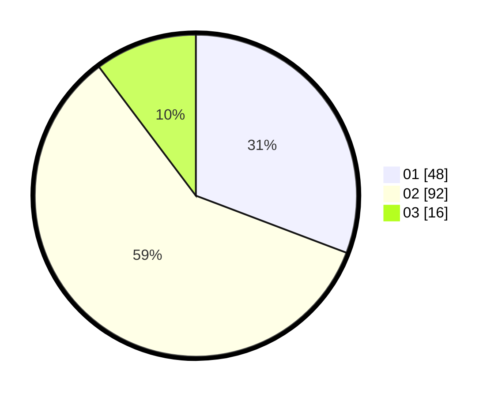

# Hasil

Hasil perolehan suara paslon dapat dilihat pada file paslon-01.txt, paslon-02.txt, dan paslon-03.txt.

Jika tidak ada, artinya data tersebut belum ada pada SIREKAP.

## Perolehan Suara

 * Paslon 01: **48**.
 * Paslon 02: **92**.
 * Paslon 03: **16**.

## Foto C Plano

https://sirekap-obj-formc.kpu.go.id/02bd/pemilu/ppwp/31/73/04/10/02/3173041002022-20240214-190329--7be5703c-aa79-483a-9db3-4e44a176f726.jpg

https://sirekap-obj-formc.kpu.go.id/02bd/pemilu/ppwp/31/73/04/10/02/3173041002022-20240214-185547--377e40b2-a808-46a0-b66c-58285a1d45a9.jpg

https://sirekap-obj-formc.kpu.go.id/02bd/pemilu/ppwp/31/73/04/10/02/3173041002022-20240214-185556--7c12cb90-d762-4c04-9fb3-274120a147b2.jpg

## DATA PEMILIH TETAP

Jumlah pemilih dalam DPT: **229**.
 * L: **121**.
 * P: **108**.

## DATA PENGGUNA HAK PILIH

Jumlah pengguna hak pilih dalam DPT: **158**.
 * L: **77**.
 * P: **81**.

Jumlah pengguna hak pilih dalam DPTb: **0**.
 * L: **0**.
 * P: **0**.

Jumlah pengguna hak pilih dalam DPK: **1**.
 * L: **1**.
 * P: **0**.

Jumlah pengguna hak pilih: **159**.
 * L: **78**.
 * P: **81**.

## JUMLAH SUARA SAH DAN TIDAK SAH

JUMLAH SELURUH SUARA SAH: **156**.

JUMLAH SUARA TIDAK SAH: **3**.

JUMLAH SELURUH SUARA SAH DAN SUARA TIDAK SAH: **159**.
