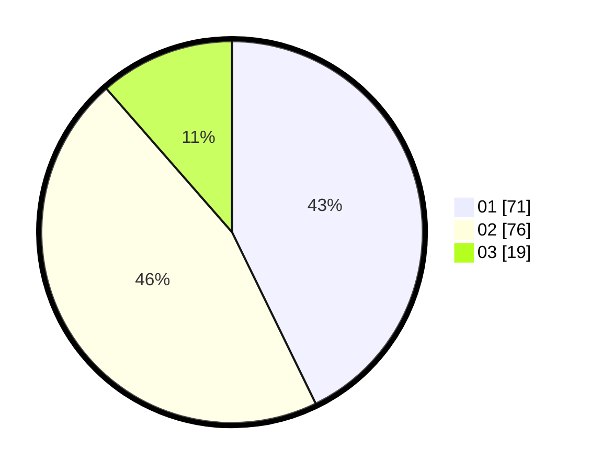

# Hasil

Hasil perolehan suara paslon dapat dilihat pada file paslon-01.txt, paslon-02.txt, dan paslon-03.txt.

Jika tidak ada, artinya data tersebut belum ada pada SIREKAP.

## Perolehan Suara

 * Paslon 01: **71**.
 * Paslon 02: **76**.
 * Paslon 03: **19**.

## Foto C Plano

https://sirekap-obj-formc.kpu.go.id/4c6b/pemilu/ppwp/31/73/04/10/02/3173041002023-20240214-190039--c5067d2c-849b-4b68-8667-480e54a799ab.jpg

https://sirekap-obj-formc.kpu.go.id/4c6b/pemilu/ppwp/31/73/04/10/02/3173041002023-20240214-191237--eb898142-c64e-4c40-ae62-922a99f7a82c.jpg

https://sirekap-obj-formc.kpu.go.id/4c6b/pemilu/ppwp/31/73/04/10/02/3173041002023-20240214-160055--f1b1c6b2-a4e7-4ffd-9e39-6a7972d95414.jpg

## DATA PEMILIH TETAP

Jumlah pemilih dalam DPT: **238**.
 * L: **128**.
 * P: **110**.

## DATA PENGGUNA HAK PILIH

Jumlah pengguna hak pilih dalam DPT: **174**.
 * L: **95**.
 * P: **79**.

Jumlah pengguna hak pilih dalam DPTb: **2**.
 * L: **1**.
 * P: **1**.

Jumlah pengguna hak pilih dalam DPK: **0**.
 * L: **0**.
 * P: **0**.

Jumlah pengguna hak pilih: **176**.
 * L: **96**.
 * P: **80**.

## JUMLAH SUARA SAH DAN TIDAK SAH

JUMLAH SELURUH SUARA SAH: **166**.

JUMLAH SUARA TIDAK SAH: **10**.

JUMLAH SELURUH SUARA SAH DAN SUARA TIDAK SAH: **176**.
