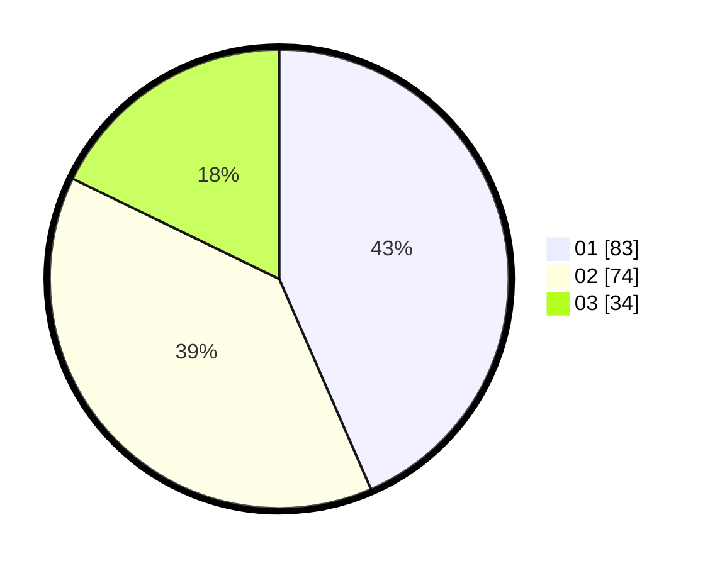

# Hasil

Hasil perolehan suara paslon dapat dilihat pada file paslon-01.txt, paslon-02.txt, dan paslon-03.txt.

Jika tidak ada, artinya data tersebut belum ada pada SIREKAP.

## Perolehan Suara

 * Paslon 01: **83**.
 * Paslon 02: **74**.
 * Paslon 03: **34**.

## Foto C Plano

https://sirekap-obj-formc.kpu.go.id/4e1b/pemilu/ppwp/31/73/04/10/02/3173041002026-20240214-155053--ddfb9142-852c-46b4-bd31-3268edeeddd1.jpg

https://sirekap-obj-formc.kpu.go.id/4e1b/pemilu/ppwp/31/73/04/10/02/3173041002026-20240214-155200--122d7c13-15bb-4105-997b-3da2b639a8f4.jpg

https://sirekap-obj-formc.kpu.go.id/4e1b/pemilu/ppwp/31/73/04/10/02/3173041002026-20240214-155331--024ab3e2-39dd-4ff9-bfe4-dc723b6bd0c8.jpg

## DATA PEMILIH TETAP

Jumlah pemilih dalam DPT: **177**.
 * L: **0**.
 * P: **0**.

## DATA PENGGUNA HAK PILIH

Jumlah pengguna hak pilih dalam DPT: **171**.
 * L: **0**.
 * P: **0**.

Jumlah pengguna hak pilih dalam DPTb: **0**.
 * L: **500**.
 * P: **0**.

Jumlah pengguna hak pilih dalam DPK: **0**.
 * L: **0**.
 * P: **0**.

Jumlah pengguna hak pilih: **0**.
 * L: **102**.
 * P: **0**.

## JUMLAH SUARA SAH DAN TIDAK SAH

JUMLAH SELURUH SUARA SAH: **191**.

JUMLAH SUARA TIDAK SAH: **2**.

JUMLAH SELURUH SUARA SAH DAN SUARA TIDAK SAH: **193**.
