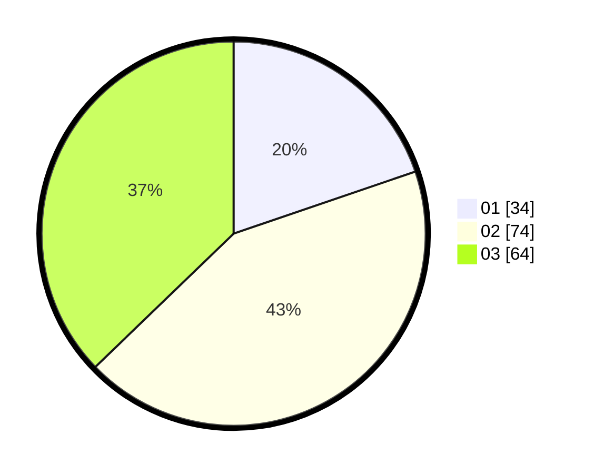

# Hasil

Hasil perolehan suara paslon dapat dilihat pada file paslon-01.txt, paslon-02.txt, dan paslon-03.txt.

Jika tidak ada, artinya data tersebut belum ada pada SIREKAP.

## Perolehan Suara

 * Paslon 01: **34**.
 * Paslon 02: **74**.
 * Paslon 03: **64**.

## Foto C Plano

https://sirekap-obj-formc.kpu.go.id/fbc5/pemilu/ppwp/31/73/04/10/02/3173041002027-20240214-155038--985af50d-107a-418b-8794-30af146da0ea.jpg

https://sirekap-obj-formc.kpu.go.id/fbc5/pemilu/ppwp/31/73/04/10/02/3173041002027-20240214-155113--3f1ba1b1-71ae-4e56-96b8-c92ff5f53e98.jpg

https://sirekap-obj-formc.kpu.go.id/fbc5/pemilu/ppwp/31/73/04/10/02/3173041002027-20240214-155140--0624379b-6a6e-4666-8f85-eaa5af539cac.jpg

## DATA PEMILIH TETAP

Jumlah pemilih dalam DPT: **248**.
 * L: **122**.
 * P: **126**.

## DATA PENGGUNA HAK PILIH

Jumlah pengguna hak pilih dalam DPT: **170**.
 * L: **78**.
 * P: **92**.

Jumlah pengguna hak pilih dalam DPTb: **3**.
 * L: **3**.
 * P: **0**.

Jumlah pengguna hak pilih dalam DPK: **0**.
 * L: **0**.
 * P: **0**.

Jumlah pengguna hak pilih: **173**.
 * L: **81**.
 * P: **92**.

## JUMLAH SUARA SAH DAN TIDAK SAH

JUMLAH SELURUH SUARA SAH: **172**.

JUMLAH SUARA TIDAK SAH: **1**.

JUMLAH SELURUH SUARA SAH DAN SUARA TIDAK SAH: **173**.
