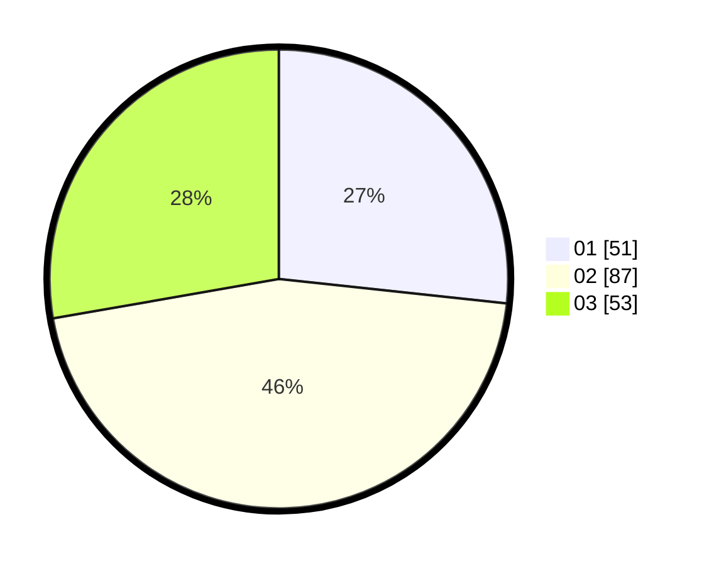

# Hasil

Hasil perolehan suara paslon dapat dilihat pada file paslon-01.txt, paslon-02.txt, dan paslon-03.txt.

Jika tidak ada, artinya data tersebut belum ada pada SIREKAP.

## Perolehan Suara

 * Paslon 01: **51**.
 * Paslon 02: **87**.
 * Paslon 03: **53**.

## Foto C Plano

https://sirekap-obj-formc.kpu.go.id/3113/pemilu/ppwp/31/73/04/10/02/3173041002028-20240214-192127--a0db939f-9887-4d22-8255-dfcad30e20ab.jpg

https://sirekap-obj-formc.kpu.go.id/3113/pemilu/ppwp/31/73/04/10/02/3173041002028-20240214-222934--1aa7c7e2-40e9-4fe4-b717-4acea72aea83.jpg

https://sirekap-obj-formc.kpu.go.id/3113/pemilu/ppwp/31/73/04/10/02/3173041002028-20240214-223040--490af51f-9215-4c6a-aabf-b47197d654c6.jpg

## DATA PEMILIH TETAP

Jumlah pemilih dalam DPT: **246**.
 * L: **123**.
 * P: **123**.

## DATA PENGGUNA HAK PILIH

Jumlah pengguna hak pilih dalam DPT: **195**.
 * L: **97**.
 * P: **98**.

Jumlah pengguna hak pilih dalam DPTb: **0**.
 * L: **0**.
 * P: **0**.

Jumlah pengguna hak pilih dalam DPK: **0**.
 * L: **0**.
 * P: **0**.

Jumlah pengguna hak pilih: **195**.
 * L: **97**.
 * P: **98**.

## JUMLAH SUARA SAH DAN TIDAK SAH

JUMLAH SELURUH SUARA SAH: **191**.

JUMLAH SUARA TIDAK SAH: **4**.

JUMLAH SELURUH SUARA SAH DAN SUARA TIDAK SAH: **195**.
