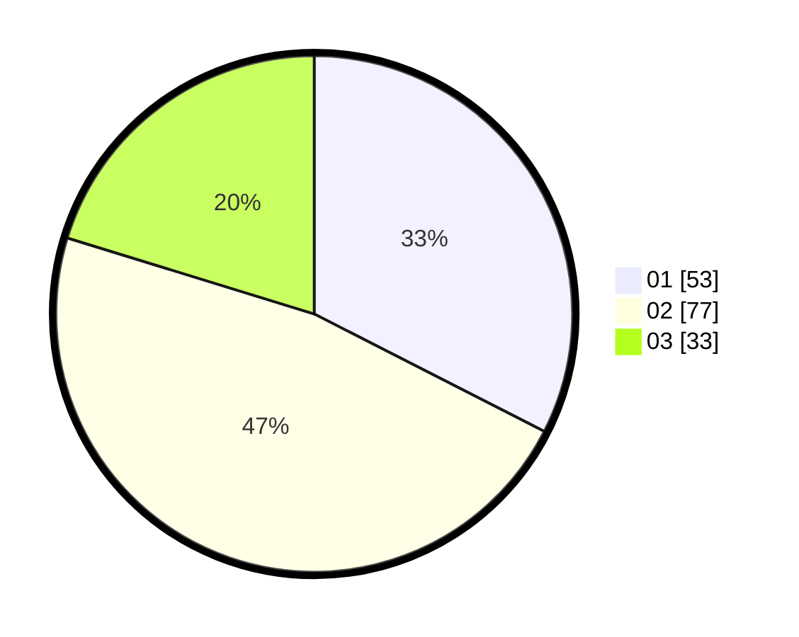

# Hasil

Hasil perolehan suara paslon dapat dilihat pada file paslon-01.txt, paslon-02.txt, dan paslon-03.txt.

Jika tidak ada, artinya data tersebut belum ada pada SIREKAP.

## Perolehan Suara

 * Paslon 01: **53**.
 * Paslon 02: **77**.
 * Paslon 03: **33**.

## Foto C Plano

https://sirekap-obj-formc.kpu.go.id/8195/pemilu/ppwp/31/73/04/10/02/3173041002029-20240216-024157--2dfc62bf-731c-40d2-9345-14336443cf7f.jpg

https://sirekap-obj-formc.kpu.go.id/8195/pemilu/ppwp/31/73/04/10/02/3173041002029-20240216-024214--eb173ab5-0d5b-448d-88e8-fc79c4a96d4e.jpg

https://sirekap-obj-formc.kpu.go.id/8195/pemilu/ppwp/31/73/04/10/02/3173041002029-20240216-024204--8e6a9f6d-5449-4a3d-a853-7171bccd5a36.jpg

## DATA PEMILIH TETAP

Jumlah pemilih dalam DPT: **219**.
 * L: **112**.
 * P: **107**.

## DATA PENGGUNA HAK PILIH

Jumlah pengguna hak pilih dalam DPT: **167**.
 * L: **84**.
 * P: **83**.

Jumlah pengguna hak pilih dalam DPTb: **0**.
 * L: **0**.
 * P: **0**.

Jumlah pengguna hak pilih dalam DPK: **1**.
 * L: **1**.
 * P: **0**.

Jumlah pengguna hak pilih: **168**.
 * L: **85**.
 * P: **83**.

## JUMLAH SUARA SAH DAN TIDAK SAH

JUMLAH SELURUH SUARA SAH: **163**.

JUMLAH SUARA TIDAK SAH: **5**.

JUMLAH SELURUH SUARA SAH DAN SUARA TIDAK SAH: **168**.
