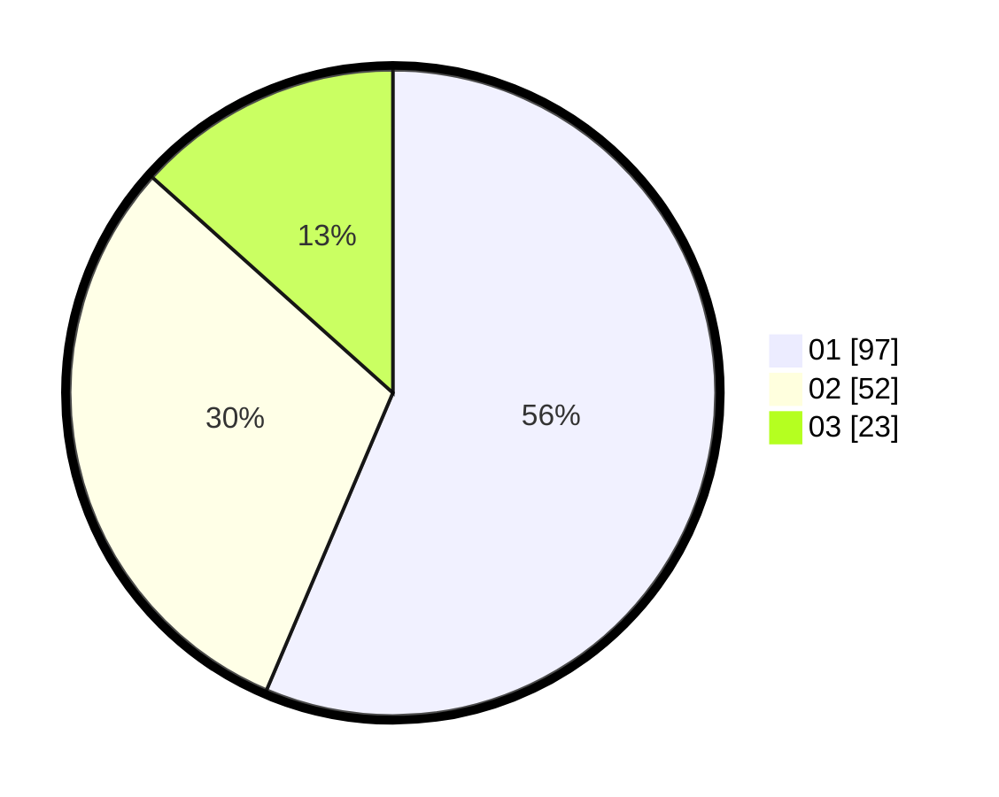

# Hasil

Hasil perolehan suara paslon dapat dilihat pada file paslon-01.txt, paslon-02.txt, dan paslon-03.txt.

Jika tidak ada, artinya data tersebut belum ada pada SIREKAP.

## Perolehan Suara

 * Paslon 01: **97**.
 * Paslon 02: **52**.
 * Paslon 03: **23**.

## Foto C Plano

https://sirekap-obj-formc.kpu.go.id/43c3/pemilu/ppwp/31/73/04/10/02/3173041002032-20240214-155152--fe20a254-9f44-4441-9cf5-b9a7b65f66fa.jpg

https://sirekap-obj-formc.kpu.go.id/43c3/pemilu/ppwp/31/73/04/10/02/3173041002032-20240215-003503--bc90a424-e147-450e-b900-c90f5d12c4e5.jpg

https://sirekap-obj-formc.kpu.go.id/43c3/pemilu/ppwp/31/73/04/10/02/3173041002032-20240214-155604--e5f32ffb-f9d3-43e6-8e4f-16b6b6781d9b.jpg
