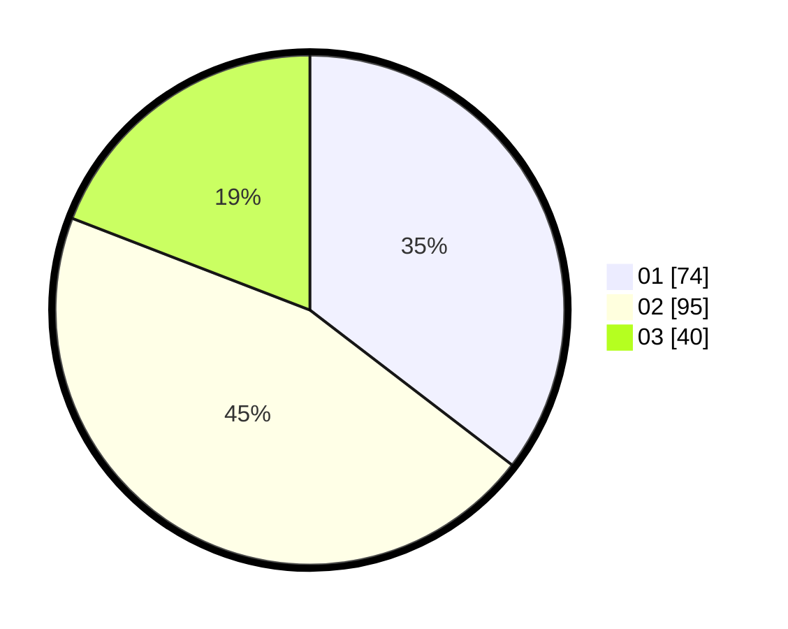

# Hasil

Hasil perolehan suara paslon dapat dilihat pada file paslon-01.txt, paslon-02.txt, dan paslon-03.txt.

Jika tidak ada, artinya data tersebut belum ada pada SIREKAP.

## Perolehan Suara

 * Paslon 01: **74**.
 * Paslon 02: **95**.
 * Paslon 03: **40**.

## Foto C Plano

https://sirekap-obj-formc.kpu.go.id/0ff5/pemilu/ppwp/31/73/04/10/02/3173041002036-20240215-214456--e764a986-b988-4d09-bdad-add1a69c2c65.jpg

https://sirekap-obj-formc.kpu.go.id/0ff5/pemilu/ppwp/31/73/04/10/02/3173041002036-20240215-214458--78fd4779-8018-45e9-8cfc-7827be361f7e.jpg

https://sirekap-obj-formc.kpu.go.id/0ff5/pemilu/ppwp/31/73/04/10/02/3173041002036-20240215-214457--e870472d-87fe-4b33-b69a-615173011cc0.jpg

## DATA PEMILIH TETAP

Jumlah pemilih dalam DPT: **287**.
 * L: **136**.
 * P: **151**.

## DATA PENGGUNA HAK PILIH

Jumlah pengguna hak pilih dalam DPT: **335**.
 * L: **123**.
 * P: **212**.

Jumlah pengguna hak pilih dalam DPTb: **0**.
 * L: **0**.
 * P: **0**.

Jumlah pengguna hak pilih dalam DPK: **0**.
 * L: **0**.
 * P: **0**.

Jumlah pengguna hak pilih: **335**.
 * L: **123**.
 * P: **212**.

## JUMLAH SUARA SAH DAN TIDAK SAH

JUMLAH SELURUH SUARA SAH: **209**.

JUMLAH SUARA TIDAK SAH: **2**.

JUMLAH SELURUH SUARA SAH DAN SUARA TIDAK SAH: **211**.
