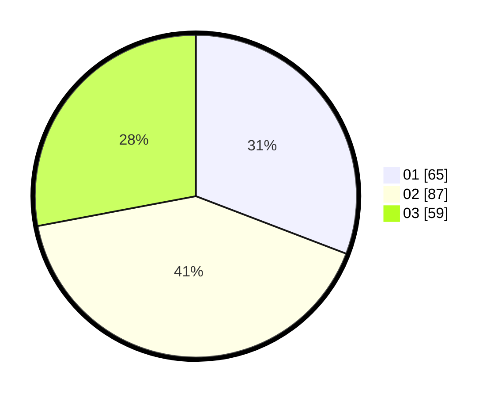

# Hasil

Hasil perolehan suara paslon dapat dilihat pada file paslon-01.txt, paslon-02.txt, dan paslon-03.txt.

Jika tidak ada, artinya data tersebut belum ada pada SIREKAP.

## Perolehan Suara

 * Paslon 01: **65**.
 * Paslon 02: **87**.
 * Paslon 03: **59**.

## Foto C Plano

https://sirekap-obj-formc.kpu.go.id/f8e6/pemilu/ppwp/31/73/04/10/02/3173041002037-20240214-200155--7e4d79bc-e1e9-4cae-9bd1-ecc65ccfa860.jpg

https://sirekap-obj-formc.kpu.go.id/f8e6/pemilu/ppwp/31/73/04/10/02/3173041002037-20240214-200425--15c80073-d64a-4ac4-ba8c-9793742ac9d4.jpg

https://sirekap-obj-formc.kpu.go.id/f8e6/pemilu/ppwp/31/73/04/10/02/3173041002037-20240214-200525--126a0793-2a8e-4190-9211-2c61137febd0.jpg

## DATA PEMILIH TETAP

Jumlah pemilih dalam DPT: **274**.
 * L: **139**.
 * P: **135**.

## DATA PENGGUNA HAK PILIH

Jumlah pengguna hak pilih dalam DPT: **210**.
 * L: **111**.
 * P: **99**.

Jumlah pengguna hak pilih dalam DPTb: **0**.
 * L: **0**.
 * P: **0**.

Jumlah pengguna hak pilih dalam DPK: **3**.
 * L: **2**.
 * P: **1**.

Jumlah pengguna hak pilih: **213**.
 * L: **113**.
 * P: **100**.

## JUMLAH SUARA SAH DAN TIDAK SAH

JUMLAH SELURUH SUARA SAH: **211**.

JUMLAH SUARA TIDAK SAH: **2**.

JUMLAH SELURUH SUARA SAH DAN SUARA TIDAK SAH: **213**.
