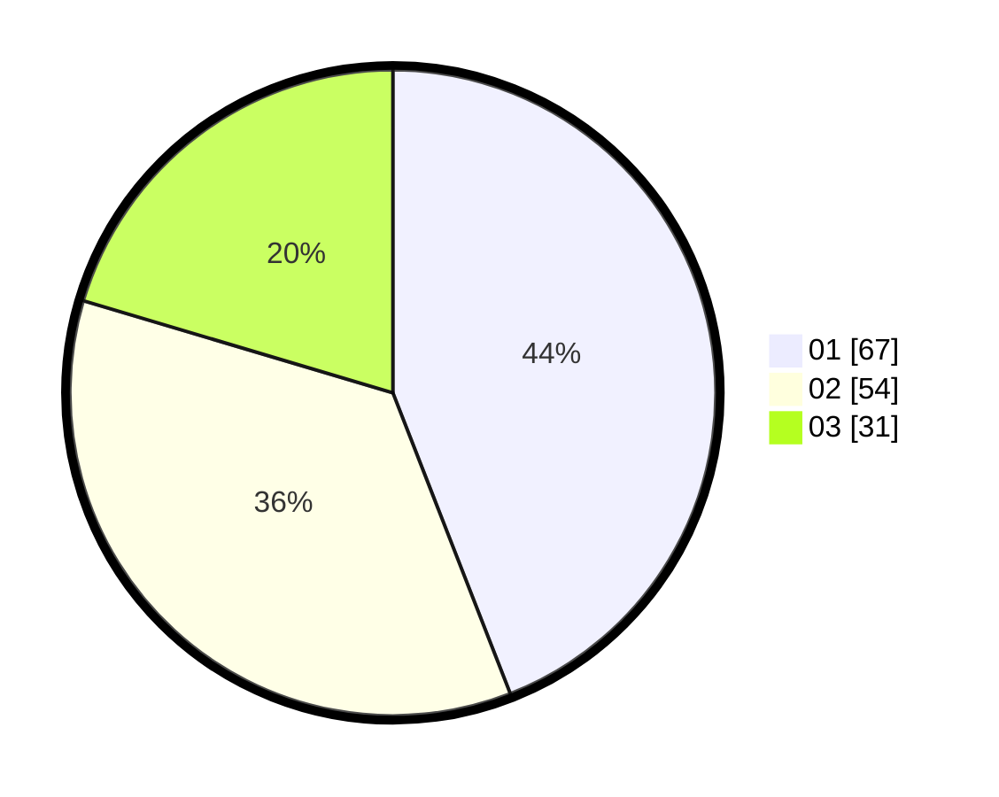

# Hasil

Hasil perolehan suara paslon dapat dilihat pada file paslon-01.txt, paslon-02.txt, dan paslon-03.txt.

Jika tidak ada, artinya data tersebut belum ada pada SIREKAP.

## Perolehan Suara

 * Paslon 01: **67**.
 * Paslon 02: **54**.
 * Paslon 03: **31**.

## Foto C Plano

https://sirekap-obj-formc.kpu.go.id/cccf/pemilu/ppwp/31/73/04/10/02/3173041002038-20240216-072030--f0859ad1-9aac-4674-81e2-ebdfa29ab7c2.jpg

https://sirekap-obj-formc.kpu.go.id/cccf/pemilu/ppwp/31/73/04/10/02/3173041002038-20240216-072042--97e294e4-9b60-47c3-8bfe-7280db0733a7.jpg

https://sirekap-obj-formc.kpu.go.id/cccf/pemilu/ppwp/31/73/04/10/02/3173041002038-20240216-074307--e2091e63-0939-472d-a26a-15dd2d55c5dd.jpg

## DATA PEMILIH TETAP

Jumlah pemilih dalam DPT: **212**.
 * L: **99**.
 * P: **113**.

## DATA PENGGUNA HAK PILIH

Jumlah pengguna hak pilih dalam DPT: **155**.
 * L: **72**.
 * P: **83**.

Jumlah pengguna hak pilih dalam DPTb: **0**.
 * L: **0**.
 * P: **0**.

Jumlah pengguna hak pilih dalam DPK: **0**.
 * L: **0**.
 * P: **0**.

Jumlah pengguna hak pilih: **155**.
 * L: **72**.
 * P: **83**.

## JUMLAH SUARA SAH DAN TIDAK SAH

JUMLAH SELURUH SUARA SAH: **152**.

JUMLAH SUARA TIDAK SAH: **3**.

JUMLAH SELURUH SUARA SAH DAN SUARA TIDAK SAH: **155**.
