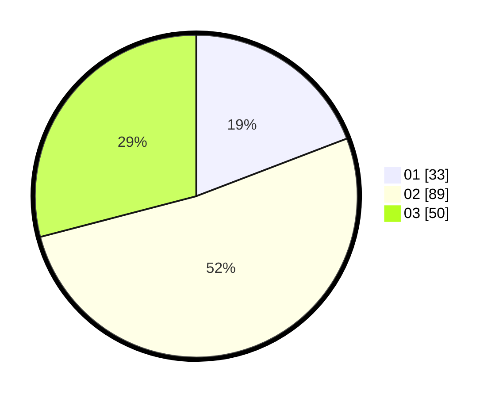

# Hasil

Hasil perolehan suara paslon dapat dilihat pada file paslon-01.txt, paslon-02.txt, dan paslon-03.txt.

Jika tidak ada, artinya data tersebut belum ada pada SIREKAP.

## Perolehan Suara

 * Paslon 01: **33**.
 * Paslon 02: **89**.
 * Paslon 03: **50**.

## Foto C Plano

https://sirekap-obj-formc.kpu.go.id/fd6d/pemilu/ppwp/31/73/04/10/02/3173041002039-20240214-220541--c7cb9b6a-5ad0-4f34-8541-192817fc9023.jpg

https://sirekap-obj-formc.kpu.go.id/fd6d/pemilu/ppwp/31/73/04/10/02/3173041002039-20240214-220625--0848eac4-4afc-4a86-9de1-d7833d2d2ac5.jpg

https://sirekap-obj-formc.kpu.go.id/fd6d/pemilu/ppwp/31/73/04/10/02/3173041002039-20240214-235428--dd948ae5-e292-4542-8d88-a57eaac7aebb.jpg
