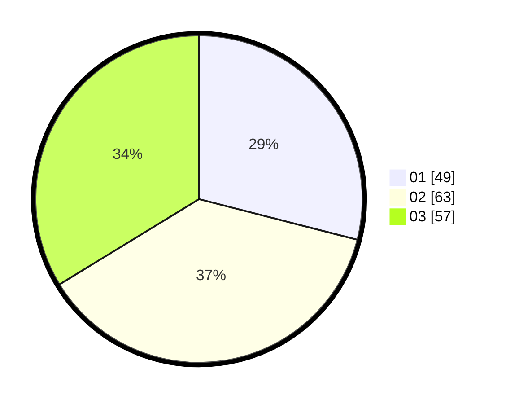

# Hasil

Hasil perolehan suara paslon dapat dilihat pada file paslon-01.txt, paslon-02.txt, dan paslon-03.txt.

Jika tidak ada, artinya data tersebut belum ada pada SIREKAP.

## Perolehan Suara

 * Paslon 01: **49**.
 * Paslon 02: **63**.
 * Paslon 03: **57**.

## Foto C Plano

https://sirekap-obj-formc.kpu.go.id/ff41/pemilu/ppwp/31/73/04/10/02/3173041002040-20240215-022149--d89bd543-6919-47e0-8b9d-ff0b0e0b0507.jpg

https://sirekap-obj-formc.kpu.go.id/ff41/pemilu/ppwp/31/73/04/10/02/3173041002040-20240214-204440--2961ce78-9190-443b-8ff6-8e67df9b3386.jpg

https://sirekap-obj-formc.kpu.go.id/ff41/pemilu/ppwp/31/73/04/10/02/3173041002040-20240214-204845--b8d3ec24-1eaf-48e2-b2d2-e52c1cead7be.jpg
