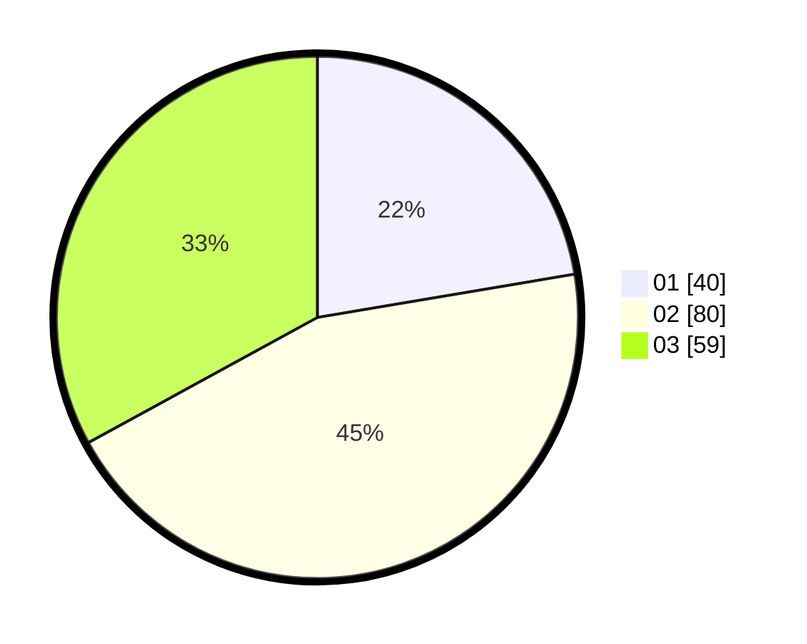

# Hasil

Hasil perolehan suara paslon dapat dilihat pada file paslon-01.txt, paslon-02.txt, dan paslon-03.txt.

Jika tidak ada, artinya data tersebut belum ada pada SIREKAP.

## Perolehan Suara

 * Paslon 01: **40**.
 * Paslon 02: **80**.
 * Paslon 03: **59**.

## Foto C Plano

https://sirekap-obj-formc.kpu.go.id/5255/pemilu/ppwp/31/73/04/10/02/3173041002043-20240216-131704--4971ce3c-2387-4b2e-a603-e0c50b346510.jpg

https://sirekap-obj-formc.kpu.go.id/5255/pemilu/ppwp/31/73/04/10/02/3173041002043-20240216-131706--c482e42b-70f7-48dc-9686-30e713583852.jpg

https://sirekap-obj-formc.kpu.go.id/5255/pemilu/ppwp/31/73/04/10/02/3173041002043-20240216-131705--c10a4f90-fa0f-464f-8fbd-e180d29ff410.jpg

## DATA PEMILIH TETAP

Jumlah pemilih dalam DPT: **295**.
 * L: **152**.
 * P: **143**.

## DATA PENGGUNA HAK PILIH

Jumlah pengguna hak pilih dalam DPT: **182**.
 * L: **90**.
 * P: **92**.

Jumlah pengguna hak pilih dalam DPTb: **3**.
 * L: **1**.
 * P: **2**.

Jumlah pengguna hak pilih dalam DPK: **1**.
 * L: **1**.
 * P: **0**.

Jumlah pengguna hak pilih: **186**.
 * L: **92**.
 * P: **94**.

## JUMLAH SUARA SAH DAN TIDAK SAH

JUMLAH SELURUH SUARA SAH: **179**.

JUMLAH SUARA TIDAK SAH: **7**.

JUMLAH SELURUH SUARA SAH DAN SUARA TIDAK SAH: **186**.
