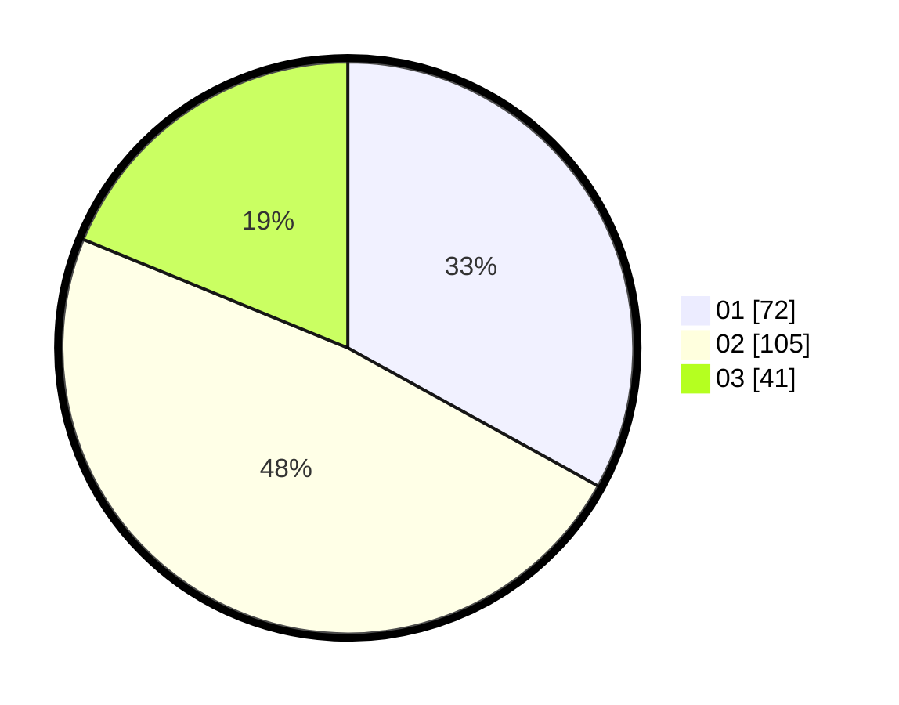

# Hasil

Hasil perolehan suara paslon dapat dilihat pada file paslon-01.txt, paslon-02.txt, dan paslon-03.txt.

Jika tidak ada, artinya data tersebut belum ada pada SIREKAP.

## Perolehan Suara

 * Paslon 01: **72**.
 * Paslon 02: **105**.
 * Paslon 03: **41**.

## Foto C Plano

https://sirekap-obj-formc.kpu.go.id/3939/pemilu/ppwp/31/73/04/10/02/3173041002044-20240215-023408--c4923d54-806a-4f81-8866-97aaaec60763.jpg

https://sirekap-obj-formc.kpu.go.id/3939/pemilu/ppwp/31/73/04/10/02/3173041002044-20240215-023450--3e13257d-2d81-4833-9014-bfe88774ce41.jpg

https://sirekap-obj-formc.kpu.go.id/3939/pemilu/ppwp/31/73/04/10/02/3173041002044-20240215-023535--92d36e29-8c73-4333-a6f5-894f2347e810.jpg
