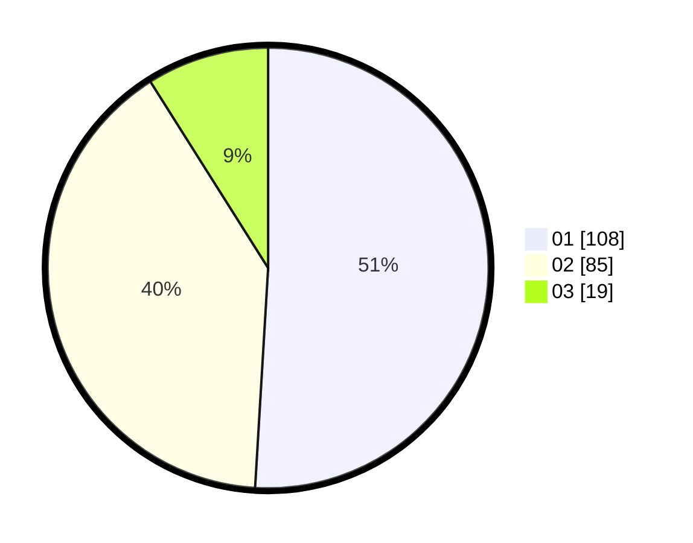

# Hasil

Hasil perolehan suara paslon dapat dilihat pada file paslon-01.txt, paslon-02.txt, dan paslon-03.txt.

Jika tidak ada, artinya data tersebut belum ada pada SIREKAP.

## Perolehan Suara

 * Paslon 01: **108**.
 * Paslon 02: **85**.
 * Paslon 03: **19**.

## Foto C Plano

https://sirekap-obj-formc.kpu.go.id/f7cb/pemilu/ppwp/31/73/04/10/02/3173041002051-20240216-043259--42adbd44-1db3-41b1-b3f6-8713f66e27da.jpg

https://sirekap-obj-formc.kpu.go.id/f7cb/pemilu/ppwp/31/73/04/10/02/3173041002051-20240216-043302--30565878-aeaa-45d4-98ea-be709284857c.jpg

https://sirekap-obj-formc.kpu.go.id/f7cb/pemilu/ppwp/31/73/04/10/02/3173041002051-20240216-043300--b72d07b1-dfa0-4b6e-82e3-cc37da209f12.jpg

## DATA PEMILIH TETAP

Jumlah pemilih dalam DPT: **0**.
 * L: **0**.
 * P: **0**.

## DATA PENGGUNA HAK PILIH

Jumlah pengguna hak pilih dalam DPT: **0**.
 * L: **0**.
 * P: **0**.

Jumlah pengguna hak pilih dalam DPTb: **0**.
 * L: **0**.
 * P: **0**.

Jumlah pengguna hak pilih dalam DPK: **0**.
 * L: **0**.
 * P: **0**.

Jumlah pengguna hak pilih: **0**.
 * L: **0**.
 * P: **0**.

## JUMLAH SUARA SAH DAN TIDAK SAH

JUMLAH SELURUH SUARA SAH: **211**.

JUMLAH SUARA TIDAK SAH: **3**.

JUMLAH SELURUH SUARA SAH DAN SUARA TIDAK SAH: **214**.
