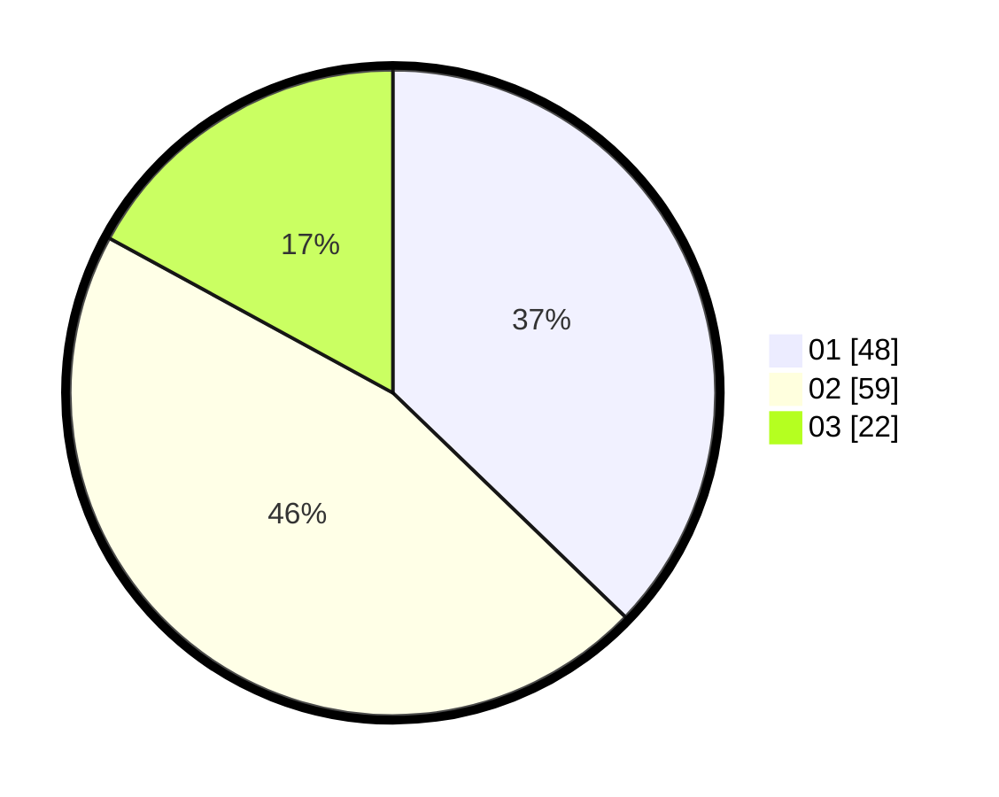

# Hasil

Hasil perolehan suara paslon dapat dilihat pada file paslon-01.txt, paslon-02.txt, dan paslon-03.txt.

Jika tidak ada, artinya data tersebut belum ada pada SIREKAP.

## Perolehan Suara

 * Paslon 01: **48**.
 * Paslon 02: **59**.
 * Paslon 03: **22**.

## Foto C Plano

https://sirekap-obj-formc.kpu.go.id/2c34/pemilu/ppwp/31/73/04/10/02/3173041002052-20240214-162217--1ab4e040-57f3-4423-8c84-0f326de1b551.jpg

https://sirekap-obj-formc.kpu.go.id/2c34/pemilu/ppwp/31/73/04/10/02/3173041002052-20240214-162241--30169406-10eb-4cbe-ab77-8941a6bf02d2.jpg

https://sirekap-obj-formc.kpu.go.id/2c34/pemilu/ppwp/31/73/04/10/02/3173041002052-20240215-225045--ec37a2eb-b975-4ba0-b17e-2e3cb7208f8f.jpg

## DATA PEMILIH TETAP

Jumlah pemilih dalam DPT: **228**.
 * L: **114**.
 * P: **114**.

## DATA PENGGUNA HAK PILIH

Jumlah pengguna hak pilih dalam DPT: **175**.
 * L: **87**.
 * P: **88**.

Jumlah pengguna hak pilih dalam DPTb: **1**.
 * L: **1**.
 * P: **0**.

Jumlah pengguna hak pilih dalam DPK: **0**.
 * L: **0**.
 * P: **0**.

Jumlah pengguna hak pilih: **176**.
 * L: **88**.
 * P: **88**.

## JUMLAH SUARA SAH DAN TIDAK SAH

JUMLAH SELURUH SUARA SAH: **170**.

JUMLAH SUARA TIDAK SAH: **6**.

JUMLAH SELURUH SUARA SAH DAN SUARA TIDAK SAH: **176**.
