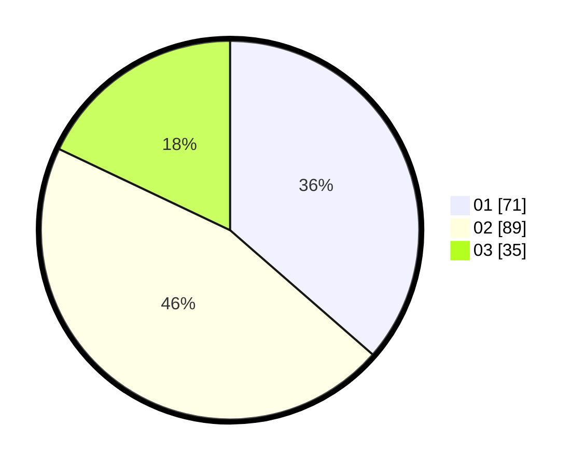

# Hasil

Hasil perolehan suara paslon dapat dilihat pada file paslon-01.txt, paslon-02.txt, dan paslon-03.txt.

Jika tidak ada, artinya data tersebut belum ada pada SIREKAP.

## Perolehan Suara

 * Paslon 01: **71**.
 * Paslon 02: **89**.
 * Paslon 03: **35**.

## Foto C Plano

https://sirekap-obj-formc.kpu.go.id/0c84/pemilu/ppwp/31/73/04/10/02/3173041002053-20240214-221400--af4644f9-2975-4228-b8e5-c440b98ee378.jpg

https://sirekap-obj-formc.kpu.go.id/0c84/pemilu/ppwp/31/73/04/10/02/3173041002053-20240214-221529--3e79e4d0-ab13-4c5d-b310-d0dcabaa7c6a.jpg

https://sirekap-obj-formc.kpu.go.id/0c84/pemilu/ppwp/31/73/04/10/02/3173041002053-20240214-221714--71dbeda9-bc4b-46cb-ab9f-377346385bd0.jpg
