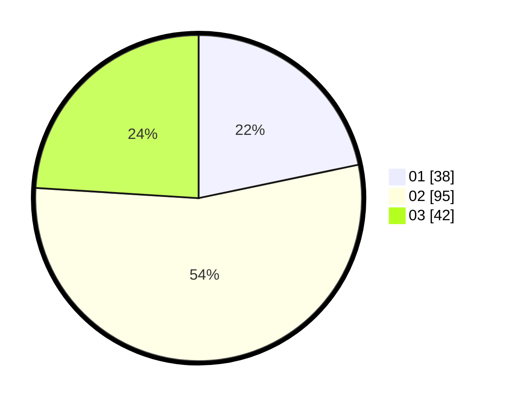

# Hasil

Hasil perolehan suara paslon dapat dilihat pada file paslon-01.txt, paslon-02.txt, dan paslon-03.txt.

Jika tidak ada, artinya data tersebut belum ada pada SIREKAP.

## Perolehan Suara

 * Paslon 01: **38**.
 * Paslon 02: **95**.
 * Paslon 03: **42**.

## Foto C Plano

https://sirekap-obj-formc.kpu.go.id/9a3f/pemilu/ppwp/31/73/04/10/02/3173041002054-20240216-133031--99aa343e-88ff-414a-9cd6-3a8b3443e40f.jpg

https://sirekap-obj-formc.kpu.go.id/9a3f/pemilu/ppwp/31/73/04/10/02/3173041002054-20240216-133033--b8cec136-970b-4864-9e52-259d608f51b7.jpg

https://sirekap-obj-formc.kpu.go.id/9a3f/pemilu/ppwp/31/73/04/10/02/3173041002054-20240216-133032--c777d831-12bf-4faa-a287-62a7efd7a9bb.jpg

## DATA PEMILIH TETAP

Jumlah pemilih dalam DPT: **255**.
 * L: **124**.
 * P: **131**.

## DATA PENGGUNA HAK PILIH

Jumlah pengguna hak pilih dalam DPT: **173**.
 * L: **83**.
 * P: **90**.

Jumlah pengguna hak pilih dalam DPTb: **173**.
 * L: **83**.
 * P: **90**.

Jumlah pengguna hak pilih dalam DPK: **3**.
 * L: **1**.
 * P: **2**.

Jumlah pengguna hak pilih: **176**.
 * L: **84**.
 * P: **92**.

## JUMLAH SUARA SAH DAN TIDAK SAH

JUMLAH SELURUH SUARA SAH: **175**.

JUMLAH SUARA TIDAK SAH: **1**.

JUMLAH SELURUH SUARA SAH DAN SUARA TIDAK SAH: **176**.
