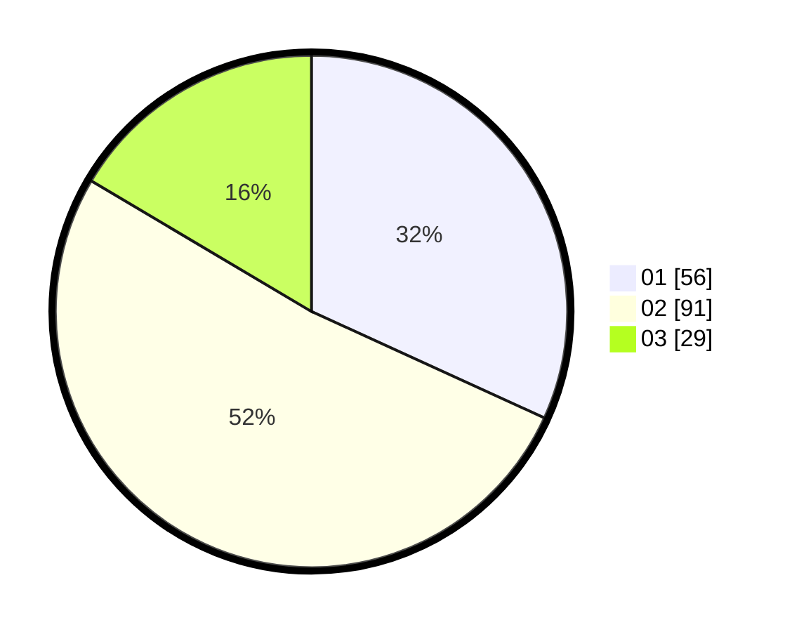

# Hasil

Hasil perolehan suara paslon dapat dilihat pada file paslon-01.txt, paslon-02.txt, dan paslon-03.txt.

Jika tidak ada, artinya data tersebut belum ada pada SIREKAP.

## Perolehan Suara

 * Paslon 01: **56**.
 * Paslon 02: **91**.
 * Paslon 03: **29**.

## Foto C Plano

https://sirekap-obj-formc.kpu.go.id/cabc/pemilu/ppwp/31/73/04/10/02/3173041002059-20240214-204348--b3455c4c-e51c-49e5-b8f6-c887420986cd.jpg

https://sirekap-obj-formc.kpu.go.id/cabc/pemilu/ppwp/31/73/04/10/02/3173041002059-20240214-204447--c9ecf3e6-b87a-4e03-9255-10caec65fe68.jpg

https://sirekap-obj-formc.kpu.go.id/cabc/pemilu/ppwp/31/73/04/10/02/3173041002059-20240214-204519--a11eae5f-f483-434e-a32b-95bac71916fb.jpg
