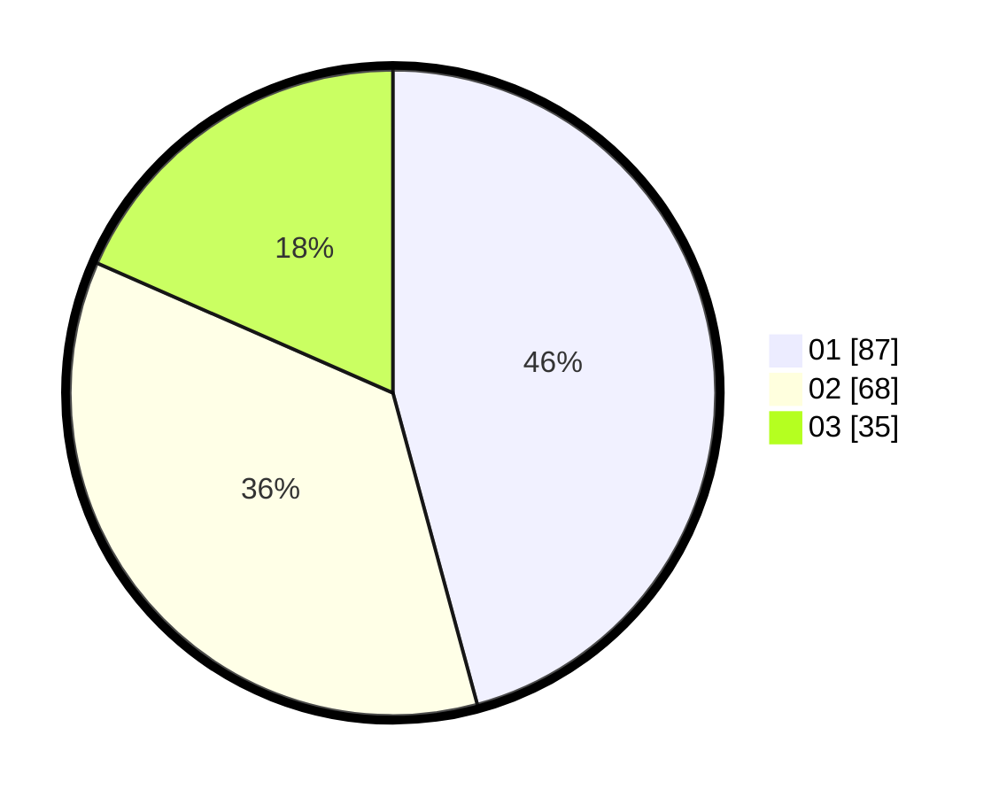

# Hasil

Hasil perolehan suara paslon dapat dilihat pada file paslon-01.txt, paslon-02.txt, dan paslon-03.txt.

Jika tidak ada, artinya data tersebut belum ada pada SIREKAP.

## Perolehan Suara

 * Paslon 01: **87**.
 * Paslon 02: **68**.
 * Paslon 03: **35**.

## Foto C Plano

https://sirekap-obj-formc.kpu.go.id/aa29/pemilu/ppwp/31/73/04/10/02/3173041002062-20240216-132718--997a769a-5a69-4fff-b89c-4e82daff1cc1.jpg

https://sirekap-obj-formc.kpu.go.id/aa29/pemilu/ppwp/31/73/04/10/02/3173041002062-20240216-132719--50adf30b-687f-4187-831b-6deadc4013bf.jpg

https://sirekap-obj-formc.kpu.go.id/aa29/pemilu/ppwp/31/73/04/10/02/3173041002062-20240216-132718--89607f37-b974-40a3-ae8d-dbb78abe6c86.jpg

## DATA PEMILIH TETAP

Jumlah pemilih dalam DPT: **275**.
 * L: **138**.
 * P: **137**.

## DATA PENGGUNA HAK PILIH

Jumlah pengguna hak pilih dalam DPT: **185**.
 * L: **88**.
 * P: **97**.

Jumlah pengguna hak pilih dalam DPTb: **0**.
 * L: **0**.
 * P: **0**.

Jumlah pengguna hak pilih dalam DPK: **7**.
 * L: **3**.
 * P: **4**.

Jumlah pengguna hak pilih: **192**.
 * L: **91**.
 * P: **101**.

## JUMLAH SUARA SAH DAN TIDAK SAH

JUMLAH SELURUH SUARA SAH: **190**.

JUMLAH SUARA TIDAK SAH: **2**.

JUMLAH SELURUH SUARA SAH DAN SUARA TIDAK SAH: **192**.
