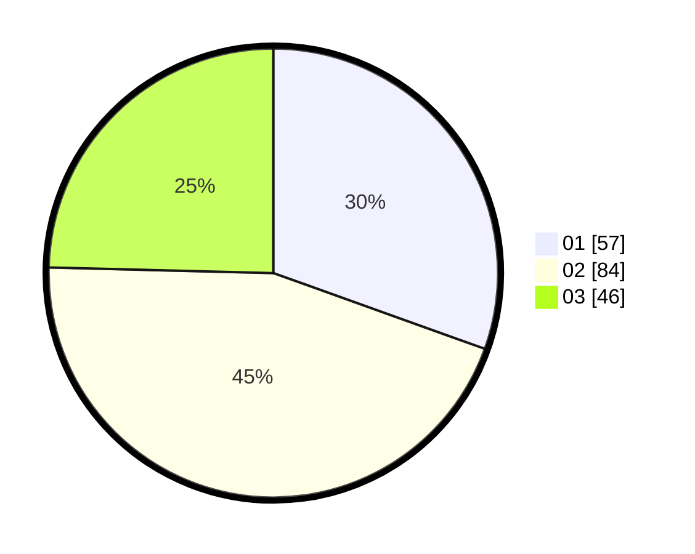

# Hasil

Hasil perolehan suara paslon dapat dilihat pada file paslon-01.txt, paslon-02.txt, dan paslon-03.txt.

Jika tidak ada, artinya data tersebut belum ada pada SIREKAP.

## Perolehan Suara

 * Paslon 01: **57**.
 * Paslon 02: **84**.
 * Paslon 03: **46**.

## Foto C Plano

https://sirekap-obj-formc.kpu.go.id/078b/pemilu/ppwp/31/73/04/10/02/3173041002064-20240214-192024--60b42811-73c2-461f-a065-07721ed610e2.jpg

https://sirekap-obj-formc.kpu.go.id/078b/pemilu/ppwp/31/73/04/10/02/3173041002064-20240215-134930--f92bdc3e-5c92-4c58-a1f4-cb959ccd477e.jpg

https://sirekap-obj-formc.kpu.go.id/078b/pemilu/ppwp/31/73/04/10/02/3173041002064-20240214-193005--353ae55e-86dc-471f-b56c-bc4b73e8a63f.jpg

## DATA PEMILIH TETAP

Jumlah pemilih dalam DPT: **267**.
 * L: **144**.
 * P: **123**.

## DATA PENGGUNA HAK PILIH

Jumlah pengguna hak pilih dalam DPT: **186**.
 * L: **95**.
 * P: **91**.

Jumlah pengguna hak pilih dalam DPTb: **1**.
 * L: **0**.
 * P: **1**.

Jumlah pengguna hak pilih dalam DPK: **0**.
 * L: **0**.
 * P: **0**.

Jumlah pengguna hak pilih: **187**.
 * L: **95**.
 * P: **92**.

## JUMLAH SUARA SAH DAN TIDAK SAH

JUMLAH SELURUH SUARA SAH: **187**.

JUMLAH SUARA TIDAK SAH: **0**.

JUMLAH SELURUH SUARA SAH DAN SUARA TIDAK SAH: **187**.
