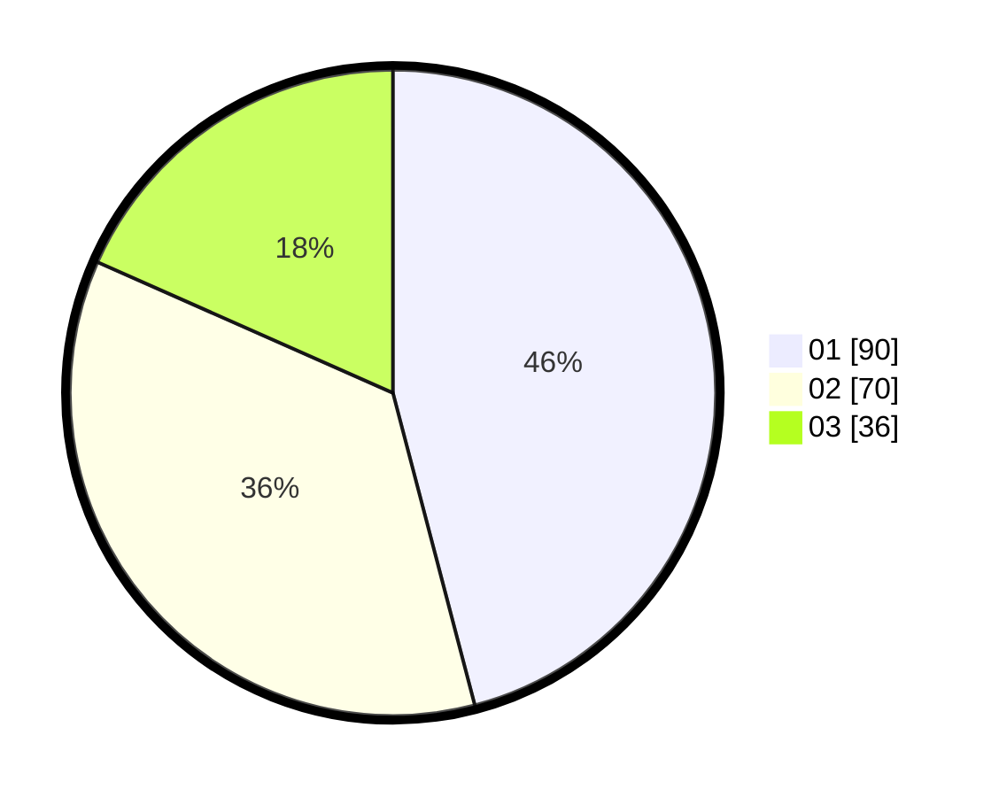

# Hasil

Hasil perolehan suara paslon dapat dilihat pada file paslon-01.txt, paslon-02.txt, dan paslon-03.txt.

Jika tidak ada, artinya data tersebut belum ada pada SIREKAP.

## Perolehan Suara

 * Paslon 01: **90**.
 * Paslon 02: **70**.
 * Paslon 03: **36**.

## Foto C Plano

https://sirekap-obj-formc.kpu.go.id/b085/pemilu/ppwp/31/73/04/10/02/3173041002065-20240218-155803--eb180368-6d4b-44d2-a31b-db30e3500a3f.jpg

https://sirekap-obj-formc.kpu.go.id/b085/pemilu/ppwp/31/73/04/10/02/3173041002065-20240218-155804--6802b137-afc7-4db7-9aa5-abe88a8e7b91.jpg

https://sirekap-obj-formc.kpu.go.id/b085/pemilu/ppwp/31/73/04/10/02/3173041002065-20240218-155803--5e09857c-1484-4a28-9459-a7dbbac90e86.jpg

## DATA PEMILIH TETAP

Jumlah pemilih dalam DPT: **271**.
 * L: **138**.
 * P: **133**.

## DATA PENGGUNA HAK PILIH

Jumlah pengguna hak pilih dalam DPT: **195**.
 * L: **91**.
 * P: **104**.

Jumlah pengguna hak pilih dalam DPTb: **3**.
 * L: **2**.
 * P: **1**.

Jumlah pengguna hak pilih dalam DPK: **2**.
 * L: **1**.
 * P: **1**.

Jumlah pengguna hak pilih: **200**.
 * L: **94**.
 * P: **106**.

## JUMLAH SUARA SAH DAN TIDAK SAH

JUMLAH SELURUH SUARA SAH: **196**.

JUMLAH SUARA TIDAK SAH: **4**.

JUMLAH SELURUH SUARA SAH DAN SUARA TIDAK SAH: **200**.
