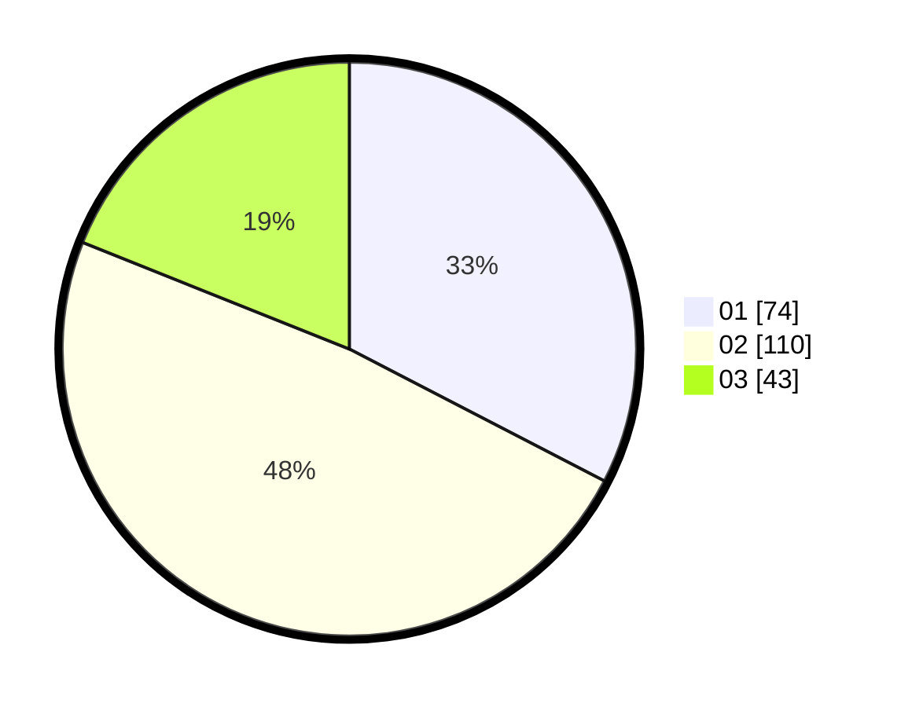

# Hasil

Hasil perolehan suara paslon dapat dilihat pada file paslon-01.txt, paslon-02.txt, dan paslon-03.txt.

Jika tidak ada, artinya data tersebut belum ada pada SIREKAP.

## Perolehan Suara

 * Paslon 01: **74**.
 * Paslon 02: **110**.
 * Paslon 03: **43**.

## Foto C Plano

https://sirekap-obj-formc.kpu.go.id/b5aa/pemilu/ppwp/31/73/04/10/02/3173041002067-20240214-193943--a0a86f50-6d4e-4d2d-9509-9b89c3a06a24.jpg

https://sirekap-obj-formc.kpu.go.id/b5aa/pemilu/ppwp/31/73/04/10/02/3173041002067-20240214-194011--5ab50709-51e6-42a4-b3a2-3791e6c75891.jpg

https://sirekap-obj-formc.kpu.go.id/b5aa/pemilu/ppwp/31/73/04/10/02/3173041002067-20240214-194029--736d5d0a-e98d-445b-95cc-5e876f666c48.jpg

## DATA PEMILIH TETAP

Jumlah pemilih dalam DPT: **288**.
 * L: **140**.
 * P: **148**.

## DATA PENGGUNA HAK PILIH

Jumlah pengguna hak pilih dalam DPT: **227**.
 * L: **107**.
 * P: **120**.

Jumlah pengguna hak pilih dalam DPTb: **0**.
 * L: **0**.
 * P: **0**.

Jumlah pengguna hak pilih dalam DPK: **0**.
 * L: **0**.
 * P: **0**.

Jumlah pengguna hak pilih: **227**.
 * L: **107**.
 * P: **120**.

## JUMLAH SUARA SAH DAN TIDAK SAH

JUMLAH SELURUH SUARA SAH: **227**.

JUMLAH SUARA TIDAK SAH: **0**.

JUMLAH SELURUH SUARA SAH DAN SUARA TIDAK SAH: **227**.
