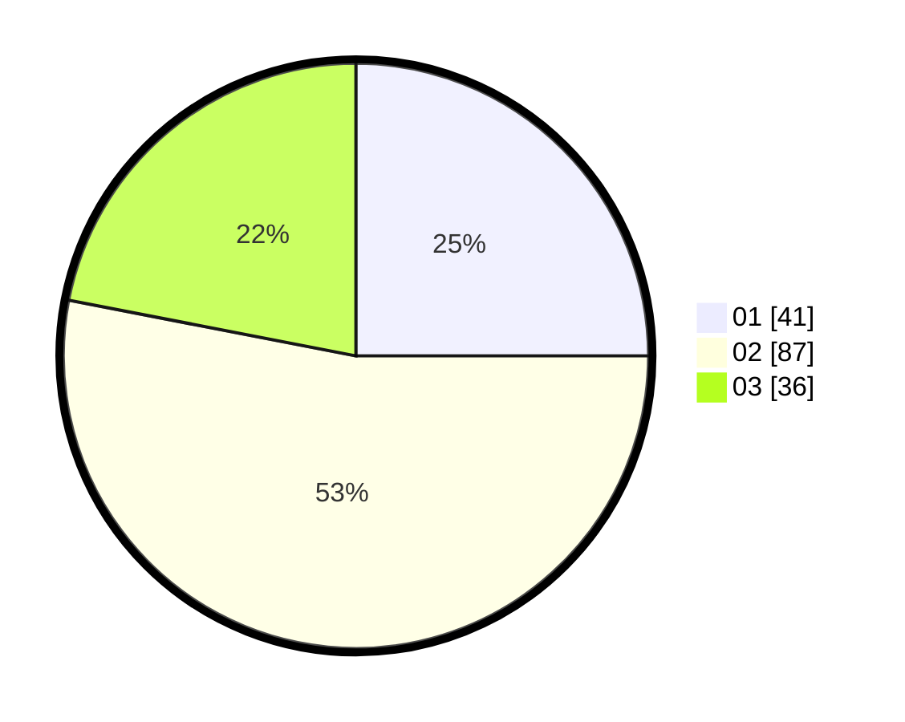

# Hasil

Hasil perolehan suara paslon dapat dilihat pada file paslon-01.txt, paslon-02.txt, dan paslon-03.txt.

Jika tidak ada, artinya data tersebut belum ada pada SIREKAP.

## Perolehan Suara

 * Paslon 01: **41**.
 * Paslon 02: **87**.
 * Paslon 03: **36**.

## Foto C Plano

https://sirekap-obj-formc.kpu.go.id/d26e/pemilu/ppwp/31/73/04/10/02/3173041002072-20240214-220825--7e8a9086-dc46-4b2f-a50b-416314890a4a.jpg

https://sirekap-obj-formc.kpu.go.id/d26e/pemilu/ppwp/31/73/04/10/02/3173041002072-20240214-220930--6daad1e6-c98c-4b6d-9b1a-3b8d8330b89c.jpg

https://sirekap-obj-formc.kpu.go.id/d26e/pemilu/ppwp/31/73/04/10/02/3173041002072-20240216-134355--72fb1dc6-c7dc-4c80-ba95-7962d34cbc9a.jpg

## DATA PEMILIH TETAP

Jumlah pemilih dalam DPT: **264**.
 * L: **133**.
 * P: **131**.

## DATA PENGGUNA HAK PILIH

Jumlah pengguna hak pilih dalam DPT: **171**.
 * L: **78**.
 * P: **93**.

Jumlah pengguna hak pilih dalam DPTb: **0**.
 * L: **0**.
 * P: **0**.

Jumlah pengguna hak pilih dalam DPK: **1**.
 * L: **0**.
 * P: **1**.

Jumlah pengguna hak pilih: **172**.
 * L: **78**.
 * P: **94**.

## JUMLAH SUARA SAH DAN TIDAK SAH

JUMLAH SELURUH SUARA SAH: **164**.

JUMLAH SUARA TIDAK SAH: **9**.

JUMLAH SELURUH SUARA SAH DAN SUARA TIDAK SAH: **173**.
