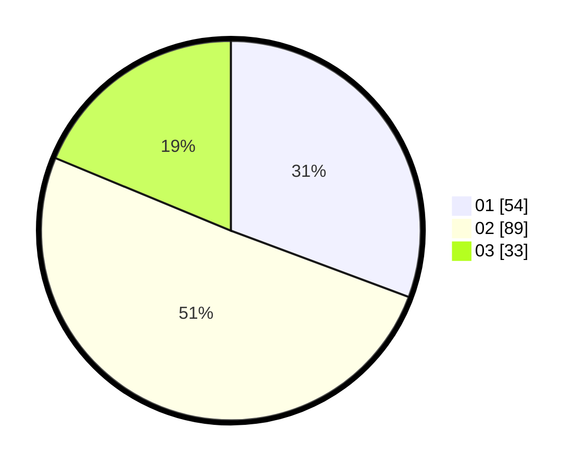

# Hasil

Hasil perolehan suara paslon dapat dilihat pada file paslon-01.txt, paslon-02.txt, dan paslon-03.txt.

Jika tidak ada, artinya data tersebut belum ada pada SIREKAP.

## Perolehan Suara

 * Paslon 01: **54**.
 * Paslon 02: **89**.
 * Paslon 03: **33**.

## Foto C Plano

https://sirekap-obj-formc.kpu.go.id/486c/pemilu/ppwp/31/73/04/10/02/3173041002074-20240216-170442--6ec721a4-3770-4510-8822-d2618138a9cb.jpg

https://sirekap-obj-formc.kpu.go.id/486c/pemilu/ppwp/31/73/04/10/02/3173041002074-20240216-170443--be0cbd38-6b5c-481e-801a-1bcbfcfbda8b.jpg

https://sirekap-obj-formc.kpu.go.id/486c/pemilu/ppwp/31/73/04/10/02/3173041002074-20240216-170442--aa17bef2-4419-4b84-a7a5-05148092e57f.jpg

## DATA PEMILIH TETAP

Jumlah pemilih dalam DPT: **267**.
 * L: **137**.
 * P: **130**.

## DATA PENGGUNA HAK PILIH

Jumlah pengguna hak pilih dalam DPT: **175**.
 * L: **86**.
 * P: **89**.

Jumlah pengguna hak pilih dalam DPTb: **1**.
 * L: **0**.
 * P: **1**.

Jumlah pengguna hak pilih dalam DPK: **1**.
 * L: **1**.
 * P: **0**.

Jumlah pengguna hak pilih: **177**.
 * L: **87**.
 * P: **90**.

## JUMLAH SUARA SAH DAN TIDAK SAH

JUMLAH SELURUH SUARA SAH: **176**.

JUMLAH SUARA TIDAK SAH: **1**.

JUMLAH SELURUH SUARA SAH DAN SUARA TIDAK SAH: **177**.
