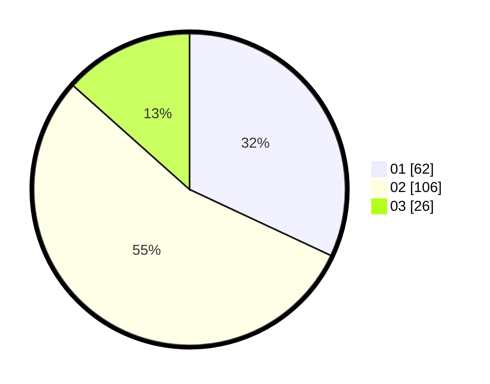

# Hasil

Hasil perolehan suara paslon dapat dilihat pada file paslon-01.txt, paslon-02.txt, dan paslon-03.txt.

Jika tidak ada, artinya data tersebut belum ada pada SIREKAP.

## Perolehan Suara

 * Paslon 01: **62**.
 * Paslon 02: **106**.
 * Paslon 03: **26**.

## Foto C Plano

https://sirekap-obj-formc.kpu.go.id/d12e/pemilu/ppwp/31/73/04/10/02/3173041002075-20240215-025834--b1399006-1c1c-404f-82c2-d2f5b1bdaac6.jpg

https://sirekap-obj-formc.kpu.go.id/d12e/pemilu/ppwp/31/73/04/10/02/3173041002075-20240215-030147--5a90bea6-7d28-4376-b9df-ed502eb29d18.jpg

https://sirekap-obj-formc.kpu.go.id/d12e/pemilu/ppwp/31/73/04/10/02/3173041002075-20240215-030558--95f042fd-9da7-4986-b7c3-216652ab231c.jpg

## DATA PEMILIH TETAP

Jumlah pemilih dalam DPT: **250**.
 * L: **133**.
 * P: **117**.

## DATA PENGGUNA HAK PILIH

Jumlah pengguna hak pilih dalam DPT: **198**.
 * L: **98**.
 * P: **100**.

Jumlah pengguna hak pilih dalam DPTb: **2**.
 * L: **1**.
 * P: **1**.

Jumlah pengguna hak pilih dalam DPK: **0**.
 * L: **0**.
 * P: **0**.

Jumlah pengguna hak pilih: **200**.
 * L: **99**.
 * P: **101**.

## JUMLAH SUARA SAH DAN TIDAK SAH

JUMLAH SELURUH SUARA SAH: **194**.

JUMLAH SUARA TIDAK SAH: **6**.

JUMLAH SELURUH SUARA SAH DAN SUARA TIDAK SAH: **6**.
