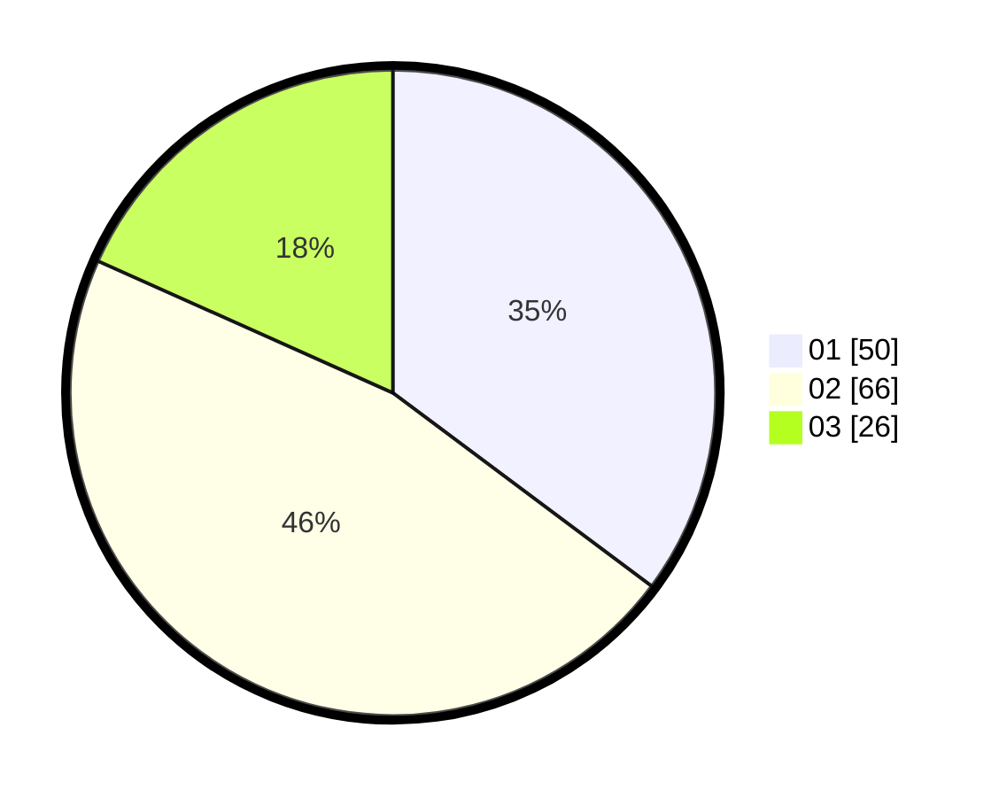

# Hasil

Hasil perolehan suara paslon dapat dilihat pada file paslon-01.txt, paslon-02.txt, dan paslon-03.txt.

Jika tidak ada, artinya data tersebut belum ada pada SIREKAP.

## Perolehan Suara

 * Paslon 01: **50**.
 * Paslon 02: **66**.
 * Paslon 03: **26**.

## Foto C Plano

https://sirekap-obj-formc.kpu.go.id/d485/pemilu/ppwp/31/73/04/10/02/3173041002076-20240214-201123--4999d288-ad1f-43ca-a6e1-40bbf20df24a.jpg

https://sirekap-obj-formc.kpu.go.id/d485/pemilu/ppwp/31/73/04/10/02/3173041002076-20240214-201310--37cda24c-de75-48ed-ae1c-81c9fa4e5c1e.jpg

https://sirekap-obj-formc.kpu.go.id/d485/pemilu/ppwp/31/73/04/10/02/3173041002076-20240214-195517--b1968b7c-5ce4-46bb-87cc-36a4d6094a3d.jpg
