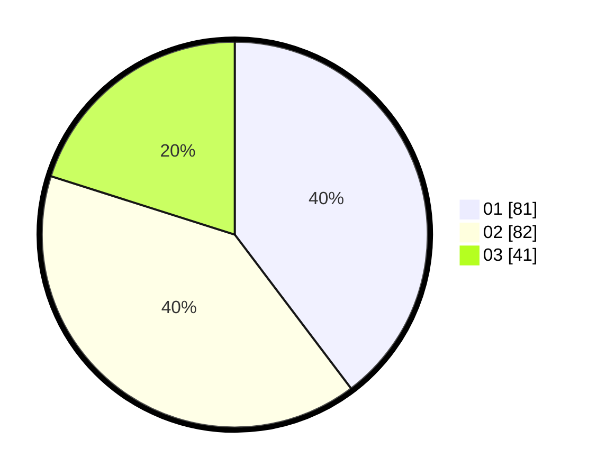

# Hasil

Hasil perolehan suara paslon dapat dilihat pada file paslon-01.txt, paslon-02.txt, dan paslon-03.txt.

Jika tidak ada, artinya data tersebut belum ada pada SIREKAP.

## Perolehan Suara

 * Paslon 01: **81**.
 * Paslon 02: **82**.
 * Paslon 03: **41**.

## Foto C Plano

https://sirekap-obj-formc.kpu.go.id/974c/pemilu/ppwp/31/73/04/10/02/3173041002081-20240216-011625--f1a026a0-05f4-4ff1-ace2-a01b67dcb65c.jpg

https://sirekap-obj-formc.kpu.go.id/974c/pemilu/ppwp/31/73/04/10/02/3173041002081-20240216-011638--dd02d6e2-41e4-44db-a001-aabce1603406.jpg

https://sirekap-obj-formc.kpu.go.id/974c/pemilu/ppwp/31/73/04/10/02/3173041002081-20240216-011633--77906d4a-0454-49ff-a665-8a2ac15f2b75.jpg

## DATA PEMILIH TETAP

Jumlah pemilih dalam DPT: **261**.
 * L: **129**.
 * P: **132**.

## DATA PENGGUNA HAK PILIH

Jumlah pengguna hak pilih dalam DPT: **202**.
 * L: **99**.
 * P: **103**.

Jumlah pengguna hak pilih dalam DPTb: **3**.
 * L: **2**.
 * P: **1**.

Jumlah pengguna hak pilih dalam DPK: **0**.
 * L: **0**.
 * P: **0**.

Jumlah pengguna hak pilih: **205**.
 * L: **101**.
 * P: **104**.

## JUMLAH SUARA SAH DAN TIDAK SAH

JUMLAH SELURUH SUARA SAH: **204**.

JUMLAH SUARA TIDAK SAH: **1**.

JUMLAH SELURUH SUARA SAH DAN SUARA TIDAK SAH: **205**.
